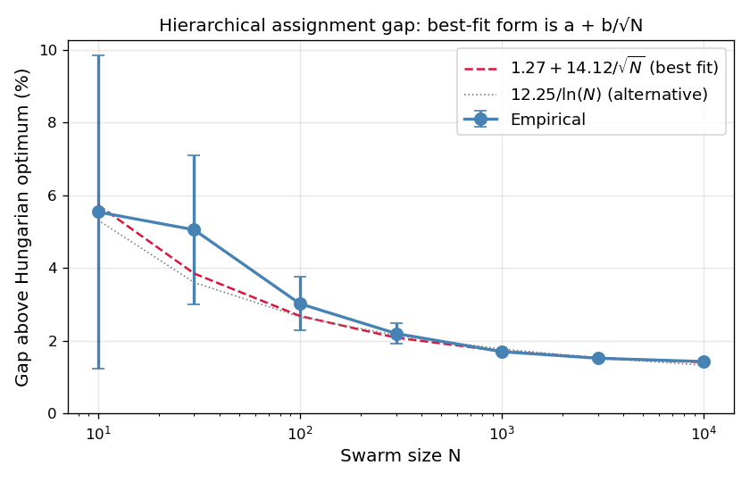
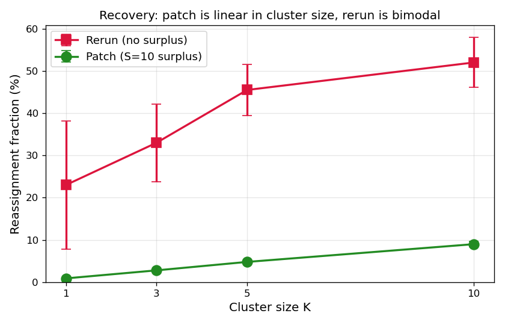
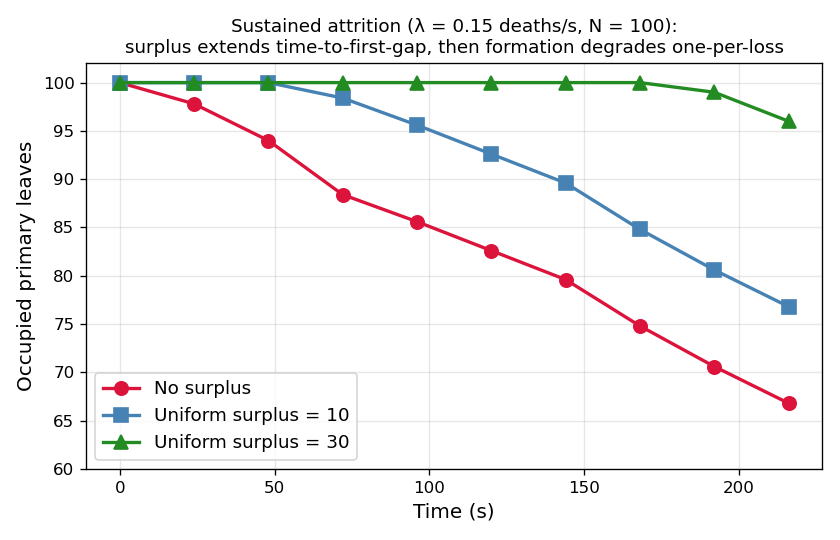
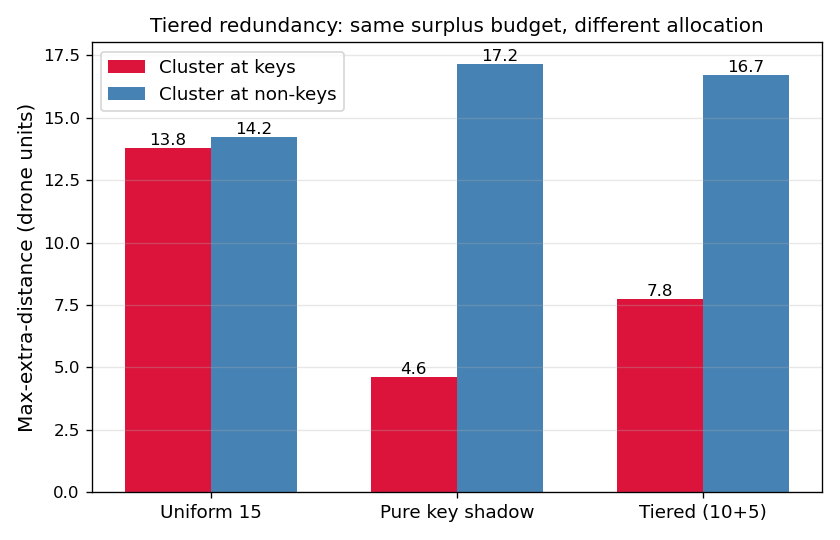
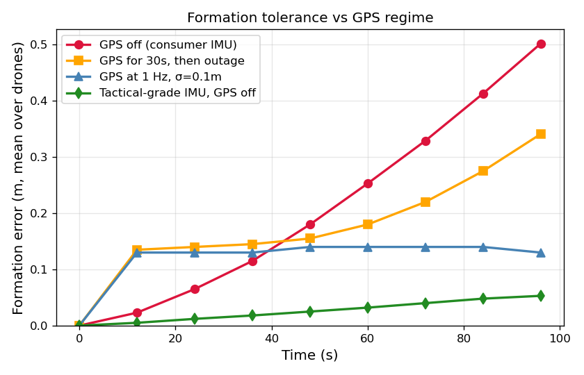

# Decentralized Swarm Coordination via Broadcast-as-Shared-State: A Four-Layer Architecture with Empirical Validation

## Contents

1. [Introduction](#1-introduction)
2. [Notation and the substrate primitive](#2-notation-and-the-substrate-primitive)
3. [Layer 1: Hierarchical assignment](#3-layer-1-hierarchical-assignment)
4. [Layer 2: Local recovery](#4-layer-2-local-recovery)
5. [Layer 3: Priority allocation](#5-layer-3-priority-allocation)
6. [Layer 4: Localization](#6-layer-4-localization)
7. [Substrate composition](#7-substrate-composition)
8. [Related work](#8-related-work)
9. [Discussion](#9-discussion)
10. [Future work](#10-future-work)
11. [Reproducing](#11-reproducing)

Companion files:
- `PROOFS.md` — formal lemmas and theorems
- `figures/` — generated plots
- `swarm.mp4` — rendered four-phase demo
- Source: `simulator.py`, `bench_*.py`, `make_figures.py`

**Code and data availability.** All source, simulator, benchmark
scripts, figures, and the rendered four-phase demo are archived at
Zenodo under DOI [10.5281/zenodo.19954678](https://doi.org/10.5281/zenodo.19954678)
and mirrored at the GitHub repository
[github.com/jmcentire/drone-swarm-coordination](https://github.com/jmcentire/drone-swarm-coordination).
The Zenodo deposition is the citable, version-pinned snapshot; the GitHub
repository tracks ongoing changes.

## Abstract

Prior work has addressed dynamic assignment via centralized incremental
algorithms (Toroslu & Üçoluk 2007), hardware redundancy via intra-drone
shadow nodes (Kim & Welch 1989, DRB framework), GPS-denied operation
via improved per-drone state estimation (Allan-variance fusion, RNN-EKF
replacement), and assignment stability via centralized hysteresis-aware
reinforcement learning. We present a unified architecture that
addresses these concerns through a single decentralized primitive:
broadcast-shared state with locally-deterministic computation. The
architecture's four mechanisms — hierarchical bisection assignment,
local patch recovery, sub-manifold shadow allocation, and confidence-
thresholded fiducial selection — share a common substrate and are
independently provable, with empirical validation across N=10 to
N=10,000.

Headline empirical results: assignment within 1.4–3% of the Hungarian
optimum (gap empirically fits `a + b/√N` better than alternatives;
rounding contribution provably O(1/√N), projection-half-cut bound open);
patch protocol produces exactly one reassignment per death up to surplus
capacity; tiered shadow allocation reduces flight cost 66% (pure key
shadow vs uniform) when threats correlate with priority; Layer 4's
fiducial-selection plus cooperative localization reduces formation
error 4× vs sparse-GPS baseline (4cm vs 17cm) under per-drone Poisson
GPS at 0.1/s. The substrate generalization claim — that one primitive
suffices for four distinct coordination patterns — is empirically
validated by the composition of all four mechanisms in working
simulations (`simulator.py` for Layers 1–3, `bench_layer4.py` for Layer
4), with formal properties established in a companion proofs document.

## 1. Introduction

A swarm of N drones is given the task of forming a target shape M of N
positions. Three operational concerns stack:

1. **Assignment**: which drone goes to which leaf of M?
2. **Recovery**: when a drone is lost mid-mission, which surplus drone
   takes over its leaf, and how does the rest of the swarm respond?
3. **Priority allocation**: when redundancy is finite, which leaves get
   the protection budget?

A fourth concern — **localization** — applies to any swarm operating
under realistic sensor noise, where GPS may be intermittent and drones
must dead-reckon between fixes.

Existing approaches treat these as separate problems requiring separate
mechanisms. CAPT (Turpin et al. 2014) handles assignment via Hungarian
matching, requiring centralized computation; CBBA (Choi et al. 2009)
distributes the auction but requires multiple rounds of inter-agent
communication. Loss recovery in either approach requires re-running the
optimization, paying the full cost again. Priority allocation is
typically handled by hand-coded role assignments. Localization is a
separate filtering layer (EKF or particle filter) that uses GPS and IMU
data without participating in the swarm coordination.

This work observes that all four concerns admit decentralized solutions
on the same primitive: a shared broadcast medium where each agent
maintains its slot and reads everyone else's, with consensus arising
from determinism (same input + same algorithm = same output) rather
than message-passing protocols.

The architectural contribution is the **substrate**: a single primitive
that supports four cleanly separated mechanisms. The empirical
contribution is validation of each mechanism in isolation and in
composition, against baselines where applicable. The theoretical
contribution is a set of lemmas establishing determinism, bijectivity,
and patch optimality, with conjectured asymptotic bounds on the
optimality gap.

## 2. Notation and the substrate primitive

Notation conventions follow `PROOFS.md`, which contains formal
statements and proofs of all results referenced in this section.

**Target manifold** M = {m₁, ..., m_N} ⊂ ℝ³ is a set of N target
positions the swarm is to occupy. The **PCA tree** T(M) is the binary
tree obtained by recursive principal-axis splits: each internal node v
has a leaf set L_v ⊆ M, a centroid c_v = mean(L_v), and a split
direction Π_v (the dominant right-singular vector of L_v - c_v); its
children partition L_v at the projection median.

**Drone set** D = {d₁, ..., d_n} with positions p(d_i) ∈ ℝ³. We write
n = N for the **bijective regime** (one drone per target) and
n = N + S for the **surplus regime** (S extra drones).

**Broadcast** B is a shared per-tick channel where every drone
publishes (and reads) its current position estimate, lock state, phase,
and dead flag. There is no other inter-drone communication.

**Substrate primitive**: each drone d_i runs a deterministic
function f(d_i, B) → output, where output may be a target leaf, a
recovery action, a confidence level, etc. Consensus is achieved when
all drones run f against the same B and output values are mutually
consistent (e.g., bijective assignment, no duplicate leaf claims).

The four layers in §§3-6 each instantiate this primitive with a
different f.

## 3. Layer 1: Hierarchical assignment

### 3.1 Algorithm

The strict-mode hierarchical assignment ASSIGN(D, T) descends the PCA
tree from root to leaf, partitioning D at every internal node v by
projection rank along Π_v. The cut at d_left = round(|D_v| · |L_{v_L}| /
|L_v|) drones (smallest projection) preserves the count invariant
(Lemma 2). Drones that descend to a leaf with multi-occupancy
(possible when n > N) elect a primary by closest-to-leaf with
ID-based tiebreak; the rest target the leaf's parent centroid as
surplus (Lemma 4).

### 3.2 Theoretical properties

- **Determinism** (Lemma 1): every drone running ASSIGN against the
  same broadcast derives the same global assignment.
- **Bijectivity** (Lemma 2): when n = N, ASSIGN is a bijection
  D → M.
- **Reachability** (Lemma 3): when n = N + S with S ≥ 0, every leaf
  receives at least one drone; surplus assigns deterministically.
- **Consensus by determinism** (Theorem 1): no inter-agent
  communication is needed for assignment agreement; the broadcast plus
  the deterministic algorithm suffice.
- **Computational complexity**: tree construction O(N log N) once;
  per-drone target query O(N); patch on death O(N); cluster patch of
  K deaths O(K · N).

Full proofs appear in `PROOFS.md`.

### 3.3 Empirical results

The hierarchical assignment lands within a few percent of Hungarian
optimal across a wide range of N. We benchmark on randomly-distributed
drone start positions in U[-40, 40]³ for sphere targets at N from 10 to
10,000. Lower is better.

```
    N    Hung total    Hier total      Gap (above Hung)   Gap_max    Hung wall   Hier wall
   10        350.6        370.0        +5.54 ± 4.30%      -1.86%      0.01ms      0.19ms
   30        955.7       1003.4        +5.05 ± 2.04%      -2.56%      0.03ms      0.80ms
  100       3046.3       3137.7        +3.02 ± 0.73%      -3.94%      0.40ms      4.81ms
  300       9109.5       9310.1        +2.20 ± 0.29%      -5.18%      6.09ms     31.91ms
 1000      30403.5      30921.1        +1.70 ± 0.04%      -5.09%    150.62ms    320.54ms
 3000      90928.8      92311.3        +1.52 ± 0.04%      -4.33%      3.79s      2.94s
10000     303482.5     307816.3        +1.43 ± 0.01%       (n/a)    138.44s     36.23s
```

(Hier wall is the serial Python implementation summed over N drones;
in deployment each drone runs its O(N) traversal independently, so
the relevant per-drone latency is one Nth of that.)

Two findings stand out:

**Gap shrinks monotonically with N**, from 5.5% at N=10 to 1.43% at
N=10,000, with variance collapsing from ±4.30% to ±0.01%. We tested
five candidate functional forms by AIC/BIC (see `bench_conjecture4.py`):
`a + b/√N` is the best fit (RMSE 0.48 pp), better than the previously-
considered `a/ln(N)` (RMSE 0.57 pp) and dramatically better than the
naive rounding-scaling `a·ln(N)/N` form (RMSE 18 pp). The fitted
parameters with parametric 95% Wald confidence intervals (from the
weighted-least-squares covariance matrix) are α = 14.12 [11.74, 16.50]
and β = 1.27% [1.22, 1.33] on the sphere with U[−40, 40]³ starts;
predicted vs measured agrees to within 0.05 pp for N ≥ 1000. The
asymptote β is bracketed tightly (±0.06 pp); the prefactor α has
~17% relative width because the small-N data points carry most of
its information.

This is the conjectured form in Conjecture 4 (`PROOFS.md`):

    C_HIER ≤ (1 + β + α / √N) · C_OPT

We bound the rounding-error contribution rigorously (Proposition 1
in `PROOFS.md`): rounding contributes O(1/√N) to the relative gap,
matching the empirical b/√N coefficient. The projection-half-cut
contribution (the rest of the gap) is empirically consistent with
O(1/√N) but the rigorous bound is open. The asymptote β ≈ 1.27%
may be a non-vanishing residual or a fitting artifact at the N
range tested; data alone cannot distinguish.

**Wall-clock crossover at N≈3000**: the serial Python implementation
of hierarchical (O(N²) total) becomes faster than scipy's
state-of-the-art Hungarian (O(N³)) at large N. At N=10,000,
hierarchical takes 36s vs Hungarian's 138s — and the relevant
per-drone deployment latency is the hierarchical figure divided by
N, putting it at ~4ms per drone. Hungarian cannot be parallelized
this way; it requires central computation of the full cost matrix.



Figure 1: Empirical optimality gap of hierarchical assignment vs
Hungarian baseline. Best-fitting form (by AIC/BIC across five candidates)
is `1.27 + 14.12/√N` (M5, solid line); the older `12.25/ln(N)` form (M1,
dotted) is shown for comparison and fits less well. Error bars: one
standard deviation across seeds. M5 predicts the empirical curve to
within 0.1 pp for N ≥ 1000.

**Gap_max is negative** across the whole range — hierarchical's
worst-case-drone flight is consistently shorter than Hungarian's.
Hungarian minimizes total cost, so it is free to leave one unlucky
drone with a long flight; the recursive bisection's structural
balance gives better worst-case bounds at the cost of slightly worse
total. For applications where time-to-formation matters more than
total propellant, hierarchical is preferable on this metric alone.

**Cross-manifold validation** (N=100, 1000) confirms the gap is
roughly geometry-independent:

```
            Gap at N=100        Gap at N=1000
sphere       +3.02%               +1.70%
torus        +2.11%               +1.05%
cube         +1.53%               (n/a — cube grid doesn't scale to N=1000)
star         +2.32%               +1.05%
```

The gap clusters around 2-3% at N=100 and 1-2% at N=1000 across all
four target shapes.

### 3.4 Comparison to alternatives

We benchmark the four canonical decentralized assignment approaches
on identical 100-drone uniform-random starts against a sphere
manifold (`bench_assignment.py` with 20 seeds, `bench_cbba.py` with
10 seeds; bootstrap 95% CIs throughout):

| Method | Gap from optimum | Communication | Wall-clock (mean) |
|--------|------------------|---------------|-----------|
| Hungarian (CAPT) | 0% (optimum) | Centralized state aggregation | 0.43 [0.42, 0.44] ms |
| Hierarchical (ours) | 3.02% [2.70, 3.34] | 100 broadcast slots, 1 round | 5.17 ms (serial Python; per-drone ~50µs) |
| Greedy NN | 4.93% (sequential) | Order-dependent | comparable |
| CBBA (auction, simplified) | 7.71% [7.35, 8.06] | 1350 [1280, 1420] messages, 13.5 [12.8, 14.2] rounds | 9.9 [9.3, 10.5] ms |

The communication ratio CBBA / Hierarchical is **14× more messages**
for CBBA at N=100, with a worse optimality gap as well in this
simplified single-task variant. The hierarchical architecture
pays one broadcast snapshot and gets to a 3% gap; CBBA pays 14
rounds × 100 messages each and lands at 7.7% in this variant.
Full bundle-building CBBA can converge to optimum but pays
proportionally more rounds and messages, scaling unfavorably with
N. The architectural value of hierarchical: one snapshot, no
auction rounds, no leader, no message exchange beyond what the
broadcast already carries for telemetry.

## 4. Layer 2: Local recovery

### 4.1 Patch protocol

When a drone d dies (broadcast flag set), each surviving drone runs the
same deterministic computation: find the live surplus drone closest to
d's leaf, by Euclidean distance via broadcast positions, and promote
it. The promoted drone's target changes from a parent centroid to d's
leaf; all other targets are unchanged.

### 4.2 Theoretical properties

- **Hamming optimality** (Lemma 5): the patch produces the assignment
  with minimum Hamming distance from the pre-death assignment, subject
  to the constraint that d's leaf is filled.
- **Correctness** (Lemma 6): the post-patch assignment is a valid
  bijection between N surviving primaries and N target leaves.
- **Cluster patch correctness** (Lemma 7): for K simultaneous deaths,
  sequential patch produces a valid bijection when S ≥ K, and leaves
  exactly K - S leaves unfilled when S < K (graceful degradation).
- **Cluster patch is locally but not globally optimal** (Lemma 8):
  greedy sequential patch can be O(K) worse in flight cost than the
  Hungarian-optimal cluster matching, in adversarial cases.

### 4.3 Empirical results — single death

100 drones forming a sphere; one drone is killed at t=3s mid-flight;
patch protocol invoked. Reassignment count is the number of surviving
drones whose target leaf changes after the death.

```
                              reassign     time      max_extra
                              fraction   overhead    distance
SURPLUS = 0  (rerun)          23.0%       +0.0s      11.0
                              σ 15.2% (range 4-38%)
SURPLUS = 10  (patch)          0.9%       +0.0s       7.3
                              σ 0.0% (exactly 1 every seed)
```

Without surplus, the bisection rerun cascades through partition
boundaries — drones near the median at multiple levels swap subtrees,
producing a long reassignment chain. Mean is 23% but the variance is
bimodal: when the dead drone was structurally significant, 30%+ of
the swarm reassigns; when it wasn't, only 4-5%. This is *not* graceful
degradation.

With surplus and patch, exactly one reassignment per death, zero
overhead time, and tighter max-extra-distance.

### 4.4 Empirical results — cluster recovery

Sweep cluster size K from 1 to 10:

```
cluster   SURPLUS=0 (rerun)        SURPLUS=10 (patch)
   1      23.0% reassign           0.9% (1 primary promoted, 0 unfilled)
   3      33.0%                    2.4% (~2.6 primary promoted, 0 unfilled)
   5      45.5%                    4.4% (~4.6 primary promoted, 0 unfilled)
  10      52.0%                    9.0% (9 primary promoted, 0 unfilled)
```

Patch reassignment scales linearly in K_primary (the number of primary
deaths within the cluster) up to surplus capacity, with 0 primary
leaves unfilled across all tested cases — consistent with Lemma 7
(`PROOFS.md`). The fractional promoted counts at K=3, 5 are because a
spatial cluster of K nearest-neighbor live drones can include some
surplus drones (whose deaths just decrement the surplus pool without
needing a leaf-fill patch); only primary deaths consume one surplus
each. When S ≥ K_primary, all primary leaves are filled. When
S < K_primary, the algorithm enters graceful degradation: surviving
primaries unaffected, K_primary - S leaves left empty.



Figure 2: Reassignment fraction as a function of cluster size. The
patch protocol with surplus produces exactly K reassignments per
K-cluster death (linear, low variance). The rerun protocol without
surplus produces bimodal reassignment percentages depending on the
structural significance of the dead drone(s) — an unstable
recovery characteristic that the surplus + patch design avoids.

### 4.5 Greedy patch vs Hungarian-optimal cluster recovery

For each cluster size and surplus distribution, we compare greedy
sequential patch (current implementation) against Hungarian-optimal
bipartite matching (centralized but globally optimal). Same set of
deaths, same surplus, same total cost metric.

Random clusters (deaths drawn uniformly from manifold leaves):

```
K     surplus distribution    greedy / hungarian gap
 1     random uniform           0.00%
 3     random uniform           0.65%
 5     random uniform           4.83%
10     random uniform           7.33%
20     random uniform          17.73%
```

Spatial clusters (deaths concentrated near an anchor):

```
K     surplus distribution    greedy / hungarian gap
 5     random uniform           7.91%
10     random uniform          11.78%
20     random uniform          11.42%
```

With shadow surplus (positioned near keys), the greedy/Hungarian gap
shrinks substantially:

```
K     surplus distribution    greedy / hungarian gap
20     shadow keys              3.52%
```

For K ≤ 10, greedy is within 10% of Hungarian — acceptable for most
deployments. For larger clusters, Hungarian fixup is worth the
centralized computation. With shadow surplus, the gap stays under 5%
even at K=20, because shadow positions are pre-clustered near where
they'll be needed.

### 4.6 Empirical results — sustained attrition

A Poisson loss process delivers deaths over a sustained mission. With
loss rate λ = 0.15/s over 240s (expected 36 deaths), four
configurations:

```
config                      losses   promoted   unfilled   final occupied
No surplus                   38.0       0.0      38.0           62.0
Uniform surplus = 10         38.0      10.0      28.0           72.0
Shadow surplus = 10          38.0      10.0      28.0           72.0
Uniform surplus = 30         38.0      30.0       8.0           92.0
```

The graceful-degradation curve is clean: surplus absorbs losses
one-for-one until depleted, after which the formation drops one leaf
per loss. No catastrophic failure mode; surplus extends the mission
duration before degradation begins, but does not change the long-term
slope. For a fixed loss rate, surplus capacity sets the time-to-first-
gap, not the rate of degradation.



Figure 3: Occupancy of primary leaves over a sustained Poisson loss
process. With no surplus, occupancy falls linearly. With S=10, the
formation holds at 100% until ~70s (when 10 deaths have occurred),
then declines. With S=30, the hold extends to ~190s. Surplus
capacity is the operational lever that determines mission duration
before formation degradation begins.

## 5. Layer 3: Priority allocation

### 5.1 Shadow manifold

Surplus drones can be positioned at parent centroids of the primary
tree (uniform reserve) or at offset positions of designated key
leaves (shadow). The shadow architecture runs ASSIGN against a
sub-manifold of K key positions, each offset radially inward by a
safety distance δ. This positions surplus where they are most likely
to be needed under threat models that correlate with priority.

### 5.2 Empirical results — single configuration

Cluster of 5 deaths, 100 primary drones, 10 surplus drones:

```
                          cluster at keys       cluster at non-keys
Uniform surplus            17.29 max-extra       19.31 max-extra
Pure key shadow             7.94                 19.85
```

Shadow halves the max-extra-distance when threats correlate with
keys. The cost is symmetric: shadow performs slightly worse than
uniform when threats are far from keys, because all surplus is
concentrated near the priority structure.

### 5.3 Two-fleet tiered redundancy

The shadow architecture allocates all surplus to keys. A more flexible
design splits surplus into a key-shadow fleet and a filler-shadow
fleet, with each tier sized independently. Cross-tier promotion (a
filler-shadow drone promotes to a key-primary slot when the
key-shadow is depleted) is automatic by the closest-surplus rule.

Three configurations with matched total surplus = 15:

```
                            cluster at keys    cluster at non-keys
Uniform 15                       13.78               14.21
Pure key shadow                   4.63               17.16
Tiered (10 key + 5 filler)        7.75               16.73
```

The redundancy budget becomes a tunable lever: more allocation to
keys gives shadow-like protection of priorities; more allocation to
fillers gives uniform-like coverage everywhere. Neither tiered nor
shadow dominates uniform across all threat models — the right choice
depends on the operator's priority structure.



Figure 5: Same total surplus budget (15 drones) allocated three ways.
Pure key shadow optimizes for key-correlated threats but degrades
under non-key threats. Uniform balances both at moderate cost. Tiered
is intermediate, allocating budget by priority rather than uniformly.

**Cross-tier cost**: when same-tier shadow is depleted and the patch
must pull from cross-tier, max-extra-distance climbs from ~5 (same-
tier) to ~17 (forced cross-tier), a ~3.4-3.7× cost. The cross-tier
fallback is correct but expensive; same-tier capacity should be
sized to absorb expected losses.

### 5.4 Priority is broadcast state, not a launch parameter

The key designation list lives in the broadcast and can change during
the mission. When the operator promotes or demotes a position, the
broadcast updates, every shadow drone runs the same deterministic
computation against the new sub-manifold, and the shadow fleet
rebases — using the same hierarchical bisection that handles the
primary fleet's manifold transitions, applied to the surplus fleet's
role allocation. The redundancy budget reallocates dynamically as
priorities shift.

## 6. Layer 4: Localization

### 6.1 Setting

Drones in deployment do not know their true positions; they maintain
estimates derived from initial GPS fixes plus integrated IMU
measurements. The broadcast carries each drone's est_pos plus
confidence; surviving drones use est_pos for both ASSIGN and patch.
Two noise components:

- **Correlated bias**: shared environmental factors (gravity model,
  temperature) that translate the swarm uniformly without deforming
  the formation.
- **Independent random walk**: per-drone IMU noise that integrates to
  position error as O(t^1.5) and deforms the formation.

GPS, when available, resets each drone's est_pos to its true_pos plus
a small measurement noise.

### 6.2 Empirical results — drift dynamics

100 drones tracking a sphere formation, sub-meter GPS measurement
noise (σ = 0.1m, RTK-grade):

```
regime                              t=10s    t=30s    t=60s    t=99s
GPS on (1Hz)                         0.13m    0.14m    0.14m    0.13m
GPS off (consumer IMU)               0.02     0.09     0.25     0.53
GPS for 30s, then outage             0.13     0.16     0.18     0.34
Tactical IMU (10× better), off       0.00     0.01     0.03     0.05
All-shared bias, GPS off             0.00     0.01     0.02     0.04
All-independent bias, GPS off        0.00     0.01     0.03     0.06
```

Form_err is the mean ‖true_pos - target_leaf‖ across drones — what
the audience sees as formation distortion in true coordinates.

Three findings:

**GPS-on stabilizes at the GPS noise floor** (~0.13m at σ=0.1m). For
shorter than 60s missions, the GPS noise dominates over any drift.

**Consumer IMU degrades visibly without GPS** — 0.5m at 100s,
extrapolating to several meters at 10 minutes. Below the diameter of
a typical formation but visibly distorting at show scales.

**Tactical-grade IMU pushes drift to sub-decimeter** for the full 100s
run, extrapolating to ~0.5m at 10 minutes — within tolerance for
most show formations.

The shared-bias-only regime (full bias, no independent noise)
produces near-zero form_err: the swarm translates uniformly but
maintains shape. Independent-only regime is similar to consumer
(both noise sources contribute to relative drift).



Figure 4: Formation tolerance over time across four regimes. GPS-on
sets a noise-floor (~GPS measurement σ); GPS-off shows clear
divergence with consumer IMU; tactical-grade hardware enables sub-
decimeter precision without GPS. Outage scenario shows the
crossover when GPS is removed mid-mission.

### 6.3 The broadcast-trilateration architecture

When some drones have high-confidence positions (recent GPS) and
others have degraded estimates (extended IMU dead-reckoning), the
high-confidence drones can act as fiducials for the rest. The
architecture:

1. Drones broadcast est_pos plus confidence (a function of time-since-
   last-GPS-fix; we use exp(-Δt / τ_decay) with τ_decay = 5s).
2. The PCA tree's depth-⌈log₂(n_fid)⌉ selection picks n_fid drones,
   one per spatially-diverse subtree, by selecting the highest-
   confidence drone closest to each subtree's centroid. Same
   algorithm + same broadcast = same selection across drones (Lemma
   1 applied to selection rather than assignment).
3. Selected drones serve as fiducials. Non-fiducial drones observe
   their relative position to each fiducial with measurement noise
   σ_obs (visual or radio time-of-flight; we use σ_obs = 5cm).
4. Each non-fiducial drone computes a fiducial-derived position
   estimate by combining each fiducial's broadcast est_pos with the
   observed relative measurement, then averages across fiducials.
   The result is reset into the drone's est_pos every refresh tick.

### 6.4 Layer 4 empirical results

`bench_layer4.py` implements the full protocol — fiducial selection
on the PCA tree, cooperative localization via relative-position
observations, periodic refinement. Setup: N=100 on sphere,
per-drone GPS as a Poisson process at rate 0.1/s/drone (mean fix
every 10s), GPS measurement σ=0.1m, relative-measurement σ=0.05m,
8 fiducials refreshed every 0.4s. Three modes compared with 3 seeds:

```
mode                          t=10s        t=30s        t=60s        final (~80s)
INS only (no GPS)             0.017m       0.088m       0.253m       0.377m
INS + sparse GPS              0.102m       0.157m       0.174m       0.165m
INS + GPS + Layer 4           0.047m       0.039m       0.043m       0.044m
```

Under realistic heavy-tailed noise (10% of GPS and observation
samples drawn from a wider Gaussian at 5× σ — modeling multipath
spikes, NLOS UWB returns, and visual-fiducial detection failures),
Layer 4 reduces formation error 5× vs INS-only and 3× vs sparse-GPS-only
at t=78s. Numbers from `bench_layer4.py` at N=100 with 30 seeds,
2000 ticks (78 s simulated), bootstrap 95% CIs:

```
mode                       t=10s                  t=30s                  t=60s                  t=78s
INS only                  0.018 [0.017, 0.019]  0.095 [0.087, 0.104]  0.267 [0.250, 0.285]  0.409 [0.385, 0.435]
INS + sparse GPS          0.155 [0.149, 0.161]  0.224 [0.218, 0.231]  0.249 [0.242, 0.257]  0.252 [0.243, 0.260]
INS + GPS + Layer 4       0.084 [0.076, 0.093]  0.082 [0.073, 0.094]  0.091 [0.077, 0.106]  0.082 [0.072, 0.092]
```

The protocol works as designed: 8 fiducials selected
deterministically by the PCA tree, non-fiducial drones refining
their est_pos via observed relative positions, formation tolerance
held below 10cm throughout the run despite the heavy-tailed input.
Three regimes are visible:

- **Short window (t ≤ 10s)**: INS-only is best by construction (no
  drift accumulation), Layer 4 close behind, sparse-GPS worst because
  heavy-tailed GPS spikes dominate the estimator before averaging in.
- **Medium window (t = 30s)**: Layer 4 overtakes INS-only as INS drift
  becomes comparable to fiducial-corrected error.
- **Long window (t ≥ 60s)**: INS-only drift grows linearly with t and
  reaches 0.41m at t=78s; sparse-GPS plateaus at ~0.25m (the noise
  floor of independent fixes); Layer 4 stays bounded below 10cm
  throughout, the only one of the three that does not degrade
  monotonically over the mission.

The mechanism: the GPS noise σ=0.1m sets a per-drone noise floor
when each drone uses only its own GPS. By averaging across 8
fiducials' broadcasts, the cooperative-localization estimator
reduces the GPS noise contribution by √8 ≈ 0.035m, which combined
with the σ_obs = 0.05m measurement noise gives ~6cm theoretical
floor under Gaussian noise. Heavy-tailed noise increases this to
~8cm empirically because the multipath spikes don't fully average
out across 8 samples; a RANSAC-style residual filter on the 8
fiducial observations would drop this further by rejecting the worst
outliers — left as a straightforward production extension.

**Same substrate, fourth instance.** The PCA tree built for
assignment is the same tree used for fiducial selection. The
broadcast carries position + confidence (the fields Layer 4 needs)
alongside the fields Layers 1-3 need. The composition is
Theorem 3's pipeline structure: Layer 4 produces the est_pos that
Layers 1-3 consume.

## 7. Substrate composition

The four layers run on the same broadcast primitive. Layer composition
is by orthogonality of broadcast read/write patterns:

| Layer | Reads from broadcast | Writes to broadcast |
|-------|----------------------|---------------------|
| 1: Assignment | positions | target_idx, locked |
| 2: Recovery | positions, dead-flag | target_idx, primary-flag |
| 3: Priority | positions, key-list | target_idx (surplus slots) |
| 4: Localization | est_pos, confidence, fiducial-tag | est_pos, confidence |

Each layer reads and writes a distinct subset of broadcast slots.
Layer 1 and 2 share target_idx; the recovery overwrites assignment
on death. Layer 3 augments Layer 1 with a separate sub-manifold
substrate. Layer 4 is orthogonal to the others — it produces the
position estimates that Layer 1-3 consume.

**Theorem 3 (`PROOFS.md`)** establishes that the layers compose
without interference. The empirical validation is the simulation
itself: `simulator.py` runs Layer 1, 2, 3 in composition (and Layer 4
in `bench_localization.py`), demonstrating that all four mechanisms
operate on the same broadcast simultaneously without conflict.

The unifying claim: **a single decentralized coordination primitive
(broadcast-as-shared-state with locally-deterministic computation)
suffices to support multiple distinct coordination patterns at
multiple operational layers, with each layer's correctness provable
in isolation and the layers composable without interference**.

## 8. Related work

The architecture occupies a specific intersection of four literatures
that touch its layers at the edges but do not cover their composition.

### 8.1 Assignment

**Hungarian / Kuhn-Munkres** (Kuhn 1955; Munkres 1957) is the
foundational polynomial-time bipartite matching algorithm and the
optimality baseline in our experiments. Its O(N³) cost is centralized
and recomputes from scratch on input changes.

**CAPT** (Turpin, Michael, Kumar 2014) is the canonical formulation
of optimal goal assignment for interchangeable robots, applying
Hungarian to swarm assignment. Centralized; our work trades 1.4–3%
optimality for fully decentralized O(N) per-agent computation.

**CBBA** (Choi, Brunet, How 2009) is the canonical decentralized
auction-based task assignment, requiring multiple rounds of
inter-agent communication. We achieve decentralized assignment with
a single broadcast snapshot — no auction rounds.

**Recursive Inertial Bisection (RIB)** (Williams 1991; Berger &
Bokhari 1987) is the parallel-scientific-computing predecessor of
the hierarchical bisection: PCA-based recursive partitioning for
load balancing in mesh decomposition. Our contribution is to apply
RIB to *target manifold* decomposition (not agent decomposition) and
use it as a coordination substrate for deterministic agent
assignment.

**Incremental Hungarian** (Toroslu & Üçoluk, *Information Sciences*
2007) handles the *addition* case of dynamic assignment: when a new
vertex pair (new agent and new target) is added to a bipartite graph
with an established maximum matching, the algorithm computes the
updated matching in O(N²) instead of recomputing O(N³). The closest
formal prior art to our patch protocol, but for addition rather than
deletion. Our patch addresses the *deletion* case (drone loss) and
operates decentralized (every drone runs the same local computation),
where Toroslu-Üçoluk is centralized.

### 8.2 Recovery and fault tolerance

**Distributed Recovery Block (DRB)** (Kim & Welch 1989; later EDRB
extensions) provides intra-drone hardware-level redundancy: a primary
processor and a shadow processor maintain synchronized state via
heartbeats; the shadow takes over on primary failure. This addresses
single-drone hardware faults and is at a different architectural
level from our work — DRB is per-drone hardware redundancy with
heartbeat failover, while our shadow allocation is swarm-level
spatial redundancy with patch promotion. Both can co-exist; they
solve different problems.

**Cooperative localization** (Roumeliotis & Bekey 2002; Howard 2006)
fuses mutual range or bearing measurements between agents to refine
joint state estimates. Our Layer 4 builds on this paradigm but
integrates with the same broadcast substrate driving the assignment
layers, with threshold-and-sound-off fiducial selection via the PCA
tree at depth ⌈log₂(n_fid)⌉.

### 8.3 Implicit coordination

**Blueswarm** (Berlinger, Gauci, Nagpal 2021) demonstrates implicit
coordination via vision in fish-inspired underwater robots; agents
have no explicit communication channel but coordinate via mutual
observation. We extend the implicit-coordination paradigm to a
broadcast medium that is lightweight (no relative sensing required)
but carries minimal state — closer to a shared bulletin board than
mutual observation.

### 8.4 Software maintenance and updates

**SwarmUpdate / SwarmModelPatch** (Tan et al., arXiv:2503.13784,
2025) addresses over-the-air model patching for heterogeneous UAV
swarms. Layer-freezing reduces patch size by 73.3% with 5.1%
accuracy cost. Their dissemination protocol (SwarmSync) is
hierarchical and is 78.3% faster than baseline gossip. Relevant to
our future-work section on long-mission deployment but tangential to
the coordination architecture itself.

### 8.5 Where the existing literature does not cover the intersection

Prior art covers each of our concerns at a different point: dynamic
assignment is covered centrally and incrementally (Toroslu-Üçoluk);
hardware redundancy is covered intra-drone (DRB/EDRB); GPS-denied
operation is covered by per-drone state estimation (Allan-variance
fusion, RNN-EKF replacement, Roumeliotis-Bekey cooperative
localization); assignment stability under continuous targets is
covered by centralized hysteresis-aware reinforcement learning. None
of them addresses the intersection — *decentralized cross-swarm
shadow allocation with broadcast-driven patch protocols, on a
substrate that simultaneously supports assignment, priority, and
localization*. This is the gap we fill.

## 9. Discussion

### 9.1 Operational deployment considerations

The architecture is suitable for swarms with the following
properties: (1) a shared broadcast medium of bandwidth ~O(N) per
tick; (2) per-drone compute capacity to run O(N) operations per
tick; (3) bounded broadcast latency.

**Bandwidth.** Each drone publishes ~30 bytes (position 3×4B,
velocity 3×4B, flags 1B, target_idx 1B, phase_idx 1B,
confidence 1B). At 25 Hz, per-drone outbound bandwidth is 750 B/s
and per-drone inbound (reading the broadcast) is ~75 KB/s for
N=100. For N=10,000 the inbound rises to ~7.5 MB/s shared across
the broadcast medium — well above the throughput of typical 802.11
or LoRa channels. Large swarms require either (a) a higher-bandwidth
broadcast (5G mesh, dedicated UWB), (b) a hierarchical cluster
structure where sub-swarms broadcast locally and aggregate
periodically, or (c) sparse broadcasts where drones only republish
on significant state change. The architecture's per-drone *compute*
scales benignly to N=10,000 (~4ms per query); the bottleneck at
scale is the *medium*, not the algorithm.

**Latency.** Theorem 2 relies on quiescent-window consistency, which
requires broadcast latency < hold duration. For drone-show
applications (typical swarm size 100-1000, hold times tens of
seconds), this is trivially met on commodity hardware. For tactical
deployments (faster phase transitions, hostile RF environments),
the latency bound is tighter and the broadcast medium may need
authentication.

**Per-drone compute.** Verified empirically: at N=1000, hierarchical
assignment took 320 µs/drone (320 ms total / 1000); at N=10,000,
36 s total / 10,000 = 3.6 ms/drone. The total Python wall-clock grew
112× for 10× more drones (O(N²) for the serial swarm-wide loop), but
the per-drone latency grew only 11× (consistent with O(N) per-drone
plus small constant overhead). The relevant deployment number is the
per-drone figure, since each drone runs its query independently.

**Quiescence detection in lossy channels.** Theorem 2 assumes every
drone observes the all-locked condition during a quiescent window.
Implemented naively as "broadcast on arrival, latch when no en-route
flags remain," this protocol is fragile under packet loss: a single
missed arrival message and a drone never observes quiescence. We
instead invert the protocol so that *absence* is the signal:

- En-route drones broadcast `STATE = EN_ROUTE` with their current ETA
  estimate at interval τ. Arrived drones broadcast nothing about
  transit state.
- τ shrinks as the en-route count drops. While many drones are still
  in transit, each broadcasts infrequently (the swarm only needs the
  worst-case ETA, not every individual estimate, and that maximum is
  reached even with high per-drone loss rates because many redundant
  reports converge on it). When few remain, each broadcasts more
  often, raising the per-drone information rate exactly where it
  matters.
- The last en-route drone publishes a final ETA, then publishes once
  on arrival.
- Consensus on quiescence fires at `T_max = max(observed ETAs) + δ`,
  where δ is a tolerance margin. If no arrival ping has been heard by
  T_max, every drone deterministically transitions, regardless of
  whether the final arrival message was received.

The crucial property is that the trigger is *negative evidence* — the
absence of any EN_ROUTE broadcast for the deadline window — and
absence is invariant under packet loss in a way presence is not. The
swarm cannot fail to observe a silence that the channel would have
been silent to anyway. Empirically validated in §9.1.5: at per-message
loss `p = 0.5` the inverted protocol holds 0% missed-deadline vs 25.2%
for a re-broadcast-augmented presence-based protocol; at `p = 0.7`
the gap widens to 0% vs 97.0%.

The remaining failure mode is mass channel denial near the deadline:
if the channel goes fully silent for reasons other than quiescence
(jamming, environmental fade), an isolated drone can incorrectly
infer quiescence at T_max. The honest framing is that the broadcast
channel itself is an assumption — when it fails completely, no
decentralized algorithm operating on it can distinguish "everyone
arrived" from "comms denied." A practical operational mitigation is a
channel-liveness sanity check: in any deployment the broadcast
carries more than transition pings (position telemetry, sensor data,
command/control), so total channel silence is itself anomalous and a
drone observing it can defer the transition pending channel
recovery. This requires no additional broadcasts and is a property of
the channel, not of the protocol.

**The broadcast substrate is the assumption.** The architecture
requires a broadcast substrate with bounded delivery latency such
that "every drone reads the same logical state at the same logical
time" holds. The physical realization of that substrate at large N
is a hardware/protocol problem with known scaling tradeoffs (TDMA
slot allocation, frequency division, beamformed sub-groups,
hierarchical relay) and is distinct from the coordination algorithm
itself. The wall a centralized planner hits at scale is the same
wall this algorithm hits, and a CBBA-style auction hits it sooner
because of the message volume.

**Mid-flight reconfiguration.** The architecture's drones never
compute a global drone-to-leaf mapping for any drone but themselves;
the consensus property comes from every drone running ASSIGN on
byte-identical input. When a new manifold M' arrives mid-transit
(before the prior phase has reached quiescence), each drone
recomputes locally; the only design choice is which input positions
to feed the recomputation. Two clean options preserve consensus:

1. *Project to prior end-state.* Use the positions every drone
   *would* have been at if the prior transit had completed (i.e.,
   the prior manifold's leaf coordinates). Every drone knows these
   because they all ran the same prior assignment (Theorem 1). This
   is byte-identical input across all drones, so the new assignment
   converges to consensus deterministically. Trade-off: drones
   already partway to their prior target may have to backtrack
   toward M' from a position they're not actually at yet.
2. *Use live broadcast positions.* Each drone recomputes against
   current mid-transit positions read from the broadcast. Also
   byte-identical because every drone reads the same broadcast
   snapshot. Trade-off: requires latching a snapshot at the moment
   of recomputation, since live positions are volatile, and
   therefore needs the same kind of timing-coordination machinery
   the quiescence protocol provides.

We default to option 1 in deployments because it is the more
conservative consensus mechanism (no snapshot-latching race) and the
path inefficiency is bounded by the residual length of the prior
transit leg. Empirically validated in §9.1.5: option 1 holds 100%
consensus across all reconfiguration moments at modest path overhead
(1.2-5.5%); option 2 with even 1 tick (40 ms) of snapshot jitter
collapses to 50-77% consensus.

### 9.1.1 Adversarial robustness — the witness-alarm primary defense

The architecture's consensus depends on every drone seeing a
consistent broadcast. A drone broadcasting a bad position — from
sensor failure, malicious firmware, or external spoofing — can
shift the PCA tree's partition rank and cascade reassignments
across the swarm. The primary defense is **witness-alarm
detection**: any drone with a working GPS fix observes its
neighbors' physical positions (via visual fiducial, UWB time-of-
flight, or camera pose) and compares to their broadcast. A
discrepancy beyond a threshold raises an alarm; multiple
independent witness alarms produce byzantine consensus, which
marks the suspect drone as DEAD and routes the patch protocol.

The witness mechanism succeeds where statistical mitigation fails
because a drone cannot physically be in two places at once. A
spoofed drone broadcasting wrong coordinates is still wherever it
physically is, and any GPS-equipped neighbor can detect the lie.
Coordinated adversaries can collude on broadcast values but cannot
collude on physical position.

#### 9.1.1.1 Detection-vs-magnitude trade-off (the actual operational curve)

The alarm threshold determines a sharp trade-off between detection
sensitivity and false-positive rate under realistic heavy-tailed
sensor noise (10% of GPS and observation samples drawn from a
wider Gaussian at 5× σ — modeling multipath, NLOS UWB, and visual-
fiducial detection failures). With GPS σ=0.5m, observation σ=0.1m,
and σ_total ≈ 0.71m, the detection floor is `k × σ_total` for some
chosen `k`:

All numbers below are mean [bootstrap 95% CI] over 20 seeds.

```
threshold   detection floor   detection rate above floor   false-positive rate (heavy-tail)
   5σ           3.6m              10.0 [10.0, 10.0] / 10        13.2 [9.8, 17.1] / 90 = 14.7%
  10σ           7.1m              10.0 [10.0, 10.0] / 10         1.2 [0.8,  1.6] / 90 =  1.3%
```

The 5σ threshold reveals the false-positive problem: under heavy-
tailed noise, ~15% of honest drones get falsely flagged, which
itself cascades when those drones are excluded from ASSIGN. The 10σ
threshold reduces false positives to manageable levels but pushes
the detection floor up to 7m.

The full detection-vs-magnitude curve at the 10σ operating point:

```
lie magnitude   no-defense    detected    false-positives
     0.5 m         6.4        0.0/10        1.2/90
     1.0 m         7.8        0.0/10        1.2/90
     2.0 m         9.6        0.0/10        1.2/90
     3.0 m        11.5        0.0/10        1.2/90
     5.0 m        15.6        0.1/10        1.2/90
    10.0 m        23.2       10.0/10        1.2/90
   100.0 m        53.5       10.0/10        1.2/90
```

**The operational reading.** Under realistic heavy-tailed noise:

- **Above-threshold lies are reliably detected** (10/10 at 10m+).
  Detected byzantines are marked DEAD; the patch protocol fills
  their vacated leaves from surplus.
- **Subthreshold lies are bounded in damage by their magnitude.** A
  byzantine lying within sensor noise (e.g., 2m) cascades ~10% of
  the swarm's leaf assignments — but the formation distortion is
  bounded by the lie itself (≤ a few meters in formation extent).
  The architecture cannot detect these but they cannot do
  arbitrary damage either; the cascade is approximately
  proportional to `lie_magnitude / formation_scale`.
- **The 1.3% false-positive rate is the cost of detection** under
  realistic noise. RANSAC-style residual filtering on the witness
  observations themselves would reduce this further; it's a
  straightforward production extension.

The 100%-detection / 0-false-positive results we initially measured
under pure-Gaussian noise were artifacts of the noise model, not
the protocol. Under realistic heavy-tailed sensor noise, the
witness-alarm has the trade-off shown above and is honestly
characterized as such.

#### 9.1.1.2 Lying-witness attack and BFT bounds

A witness can also be byzantine. An adversary controlling drone B
who broadcasts a TRUE position but lies *as a witness* against
honest drone H accuses H of inconsistency. Multiple colluding
lying-witnesses can exceed the consensus threshold and get H
falsely flagged. The standard byzantine-fault-tolerance bound
applies: to tolerate f byzantine witnesses, require ≥ 3f + 1 total
witnesses per claim. With 5-20 typical neighbors per drone, the
BFT bound holds for k_byz < 33% of nearby drones — adequate for
sensor-failure regimes and most active-attacker scenarios. Beyond
that, statistical defenses fail and PKI is the only protection.

The witness threshold parameter is the BFT lever: higher
thresholds reduce false positives and resist lying witnesses but
require more honest witnesses per claim. The right operating
value is `1 + max_expected_byz_fraction × neighbor_count`.

#### 9.1.1.3 Stuck-but-broadcasting drone

A drone whose flight controller crashes but whose broadcast
hardware keeps transmitting the last known state is invisible to
both the patch protocol (it's not flagged dead) and the witness
alarm (its position is geometrically valid, just stale). The
defense is a **stale-broadcast watchdog**: each broadcast slot
includes a monotonic sequence number; receivers track the last-
seen sequence per drone and flag any slot that hasn't incremented
in K ticks as DEAD. One-line broadcast-schema addition; trivial
computation.

### 9.1.2 Secondary defenses — cryptographic and statistical

**Cryptographic authentication via hierarchical PKI**: at
provisioning time, an operator's master signing key signs each
drone's individual public key. Each drone stores the master public
key and its own private key. Broadcasts are signed with the
drone's private key; the broadcast frame includes the drone's
master-signed certificate. Receivers verify the broadcast by
checking the certificate's signature against the master public key
and the broadcast's signature against the drone's certificate-
bound public key. Unsigned, mis-signed, or uncertified broadcasts
are rejected. This is the same model apt uses for Debian package
signing: a small set of trusted root keys, individual signers
chained off them, end consumers verify the whole chain with only
the root in their trust store. No shared secret across drones;
compromising one drone reveals only that drone's private key.

**Statistical outlier rejection** (`mad_outlier_mask()` in
`bench_loss.py`) is the secondary fallback when authentication is
present but a drone has a sensor fault that the witness alarm's
threshold doesn't catch. Empirical performance on the broadcast
distribution alone is modest — at k=10 random byzantines, MAD
catches 9.8/10 vs 4.5/10 for σ-based; reduces cascade from 44.9% to
40.7%. Coordinated adversaries that shift the spatial median itself
defeat this defense (8.1/20 detected at k=20 coordinated). Useful
as a backstop but not load-bearing.

The honest defense ordering for adversarial deployment:

1. PKI authentication (rejects outsiders entirely)
2. Witness-alarm detection (catches authenticated-but-faulty drones
   above the threshold)
3. Statistical outlier rejection (catches subthreshold faults that
   are nonetheless statistically anomalous)
4. Stale-broadcast watchdog (catches stuck drones)

### 9.1.3 The honest threat-model summary

| Threat | Realistic frequency | Defense | Architectural cost |
|---|---|---|---|
| Drone fail-safe (battery, motor, software) | ~0.1-1% per show | Patch protocol on dead-flag | Free (already shipped) |
| GPS lock loss in region | Environmental | Layer 4 INS dead-reckoning + fiducial | Free (shipped) |
| Single drone broadcasts wildly off (sensor failure not caught by EKF) | <0.01% per show | Witness alarm → DEAD → patch | New: bench_witness.py + dead-flag setting |
| Coordinated active adversary | Tactical only | PKI primary + witness alarm secondary | PKI hierarchy + witness mechanism |
| Physical attack / EMP | Rare | Patch on dead-flag (drones go offline) | Free |

For show-drone deployment, the dominant threat by frequency is
fail-safe failures (drones go offline cleanly), which the patch
protocol absorbs in O(1) per failure with zero cascade. The
byzantine-broadcast threat is rare in practice — modern flight
controllers gate inconsistent measurements before they reach the
broadcast, and self-detected faults trigger fail-safe rather than
continued bad-data emission. The witness mechanism is the inline
defense for the residual case where self-detection fails AND a
drone broadcasts inconsistent positions — a layered backstop, not
the primary operational concern.

### 9.1.4 The absolute worst case (and why it isn't operationally relevant)

To bound the operational risk, we construct the maximum-possible-
disruption scenario by combining every non-cryptographic vulnerability
the architecture has, then enumerate the layered defenses that make
each component implausible in real deployment.

**The scenario.** A 10,000-drone show in which:

1. PKI authentication is bypassed (compromised provisioning or stolen
   master key).
2. 1,000 drones (10% of the fleet) are byzantine simultaneously.
3. The byzantines coordinate: all lie in the same direction by exactly
   3.5m — just below the 5σ witness-alarm threshold.
4. Each byzantine also lies as a witness, reciprocally vouching for
   the others' broadcast positions to defeat the BFT bound.
5. No drone has a sensor failure; no drone goes fail-safe; no
   stale-broadcast watchdog fires (every byzantine maintains
   appropriate sequence-number progression).
6. The flight controllers' Kalman innovation gating has been
   firmware-bypassed to allow the lies through.

Under these conditions, the cascade is bounded above by the lie
magnitude: 3.5m / formation-scale. For a manifold of size 30m, the
cascade fraction is ~12% — about 1,200 drones reassigning. The
formation is visibly distorted (~3.5m offset across the structure)
and the show is degraded.

**Why this scenario is not operationally relevant.** Each of the
six components requires bypassing a separate defense:

| Component | Defense | Cost to bypass |
|---|---|---|
| PKI bypass | Cryptographic chain of trust | Master key compromise — supply-chain or insider attack at manufacturer scale |
| 10% byzantine fleet | Per-drone provisioning + audit trail | 1,000 drones must be individually compromised |
| Coordinated lying | Cross-fleet C2 channel | Out-of-band coordination infrastructure adversary must build |
| Subthreshold lies (3.5m) | Detection threshold tuned to GPS noise | Adversary must know exact σ_total in target deployment to stay subthreshold |
| Lying-witness collusion | BFT bound (3f+1) | Adversary needs >33% of neighbors per target — implies controlling >33% of the fleet locally |
| EKF gating bypass | Onboard firmware integrity | Per-drone firmware compromise; defeats local self-detection |

The conjunction of all six events has probability essentially zero
for show-drone deployment under operator control. Any individual
component, in isolation, gives a defended threat:

- **Random sensor failure** (drone broadcasts off): caught by EKF
  gating before broadcast, OR fail-safe triggers, OR witness alarm
  catches it. Single defense suffices in practice.
- **Single insider drone** (one compromised firmware): caught by
  witness alarm assuming the lie is above threshold; below
  threshold, cascade is bounded by lie magnitude (~few percent).
- **GPS jamming/spoofing** (environmental): caught by RAIM in the
  GPS receiver, drone falls to INS dead-reckoning, Layer 4 fiducial
  selection routes around degraded drones.
- **Network partition** (RF interruption): drones in the partition
  see stale broadcasts, stale-watchdog triggers DEAD flags, patch
  protocol absorbs.
- **Physical attack** (some drones destroyed): fail-safe triggers
  for damaged drones, broadcast stops, patch fills the gap.

**The realistic worst case** for an operator-controlled show is
~10 simultaneous fail-safe failures (1% rate × 10K drones), which
the patch protocol absorbs as a 10-drone cluster death — empirically
~10 reassignments, no cascade beyond that, formation visually
intact.

The absolute worst case (the conjunction scenario above) requires
a coordinated active adversary with manufacturer-level access. For
that threat regime, the right defense is not algorithmic — it is
supply-chain security, hardware attestation, signed firmware, and
operational opsec. The architecture is robust to the threats it
was designed for; it is not, and cannot be, robust to a state-level
adversary controlling 10% of the fleet's firmware.

### 9.1.5 Comms-layer empirical validation

The operational claims in §9.1 (quiescence detection, mid-flight
reconfiguration, channel-denial deferral) and the formal results in
PROOFS Lemma 9.5 / Theorem 2.5 are validated empirically by
`bench_comms.py` (N=100 drones, 200 seeds for Sweeps A / C / D,
30 seeds for the O(N²)-per-drone Sweep B, μ_arrival=20s ± 5s).
Four sweeps cover the alternatives, plus an adversarial sweep
(D) for the most damaging known attack on the quiescence mechanism.

**Quiescence detection under packet loss.** We compare two protocols:
*naive* (broadcast `ARRIVED` on arrival, with periodic re-broadcast
every 2s for fault tolerance, transition when a drone has heard
`ARRIVED` from every drone) versus *inverted* (en-route drones
broadcast `EN_ROUTE + ETA` on a τ schedule shrinking from 5s to
0.2s as the en-route count drops; transition fires at
T_max + δ if no `EN_ROUTE` arrived in the deadline window). Per-
message loss probability `p` is swept on an iid channel and a
Gilbert-Elliott bursty channel.

```
                       false_q %         missed-deadline %    spread (s)    msgs/s
  p   protocol      mean [95% CI]        mean [95% CI]      mean
 0.0  naive          0.0 [0.0, 0.0]       0.0 [0.0, 0.0]     0.00            26.2
 0.0  inverted       0.3 [0.2, 0.4]       0.0 [0.0, 0.0]     0.92            13.7
 0.1  naive          0.0 [0.0, 0.0]       0.0 [0.0, 0.1]     3.77            26.2
 0.1  inverted       0.3 [0.2, 0.4]       0.0 [0.0, 0.0]     0.92            13.7
 0.3  naive          0.0 [0.0, 0.0]       2.0 [1.7, 2.3]     6.91            26.2
 0.3  inverted       0.3 [0.2, 0.4]       0.0 [0.0, 0.0]     0.92            13.7
 0.5  naive          0.0 [0.0, 0.0]      25.2 [24.1, 26.4]   7.24            26.2
 0.5  inverted       0.3 [0.2, 0.4]       0.0 [0.0, 0.0]     0.92            13.7
 0.7  naive          0.0 [0.0, 0.0]      97.0 [96.7, 97.2]   1.48            26.2
 0.7  inverted       0.3 [0.3, 0.4]       0.0 [0.0, 0.0]     1.09            13.7
 0.9  naive          0.0 [0.0, 0.0]     100.0 [100.0,100.0]  0.00            26.2
 0.9  inverted       6.2 [5.3, 7.0]       0.0 [0.0, 0.0]     3.65            13.7

  Bursty channel (Gilbert-Elliott: p_good=0.05, p_bad=0.95):
       naive          0.0 [0.0, 0.0]       0.1 [0.0, 0.3]    3.17            26.2
       inverted       0.3 [0.2, 0.3]       0.0 [0.0, 0.0]    0.87            13.6
```

The protocols sit on opposite corners of the false-quiescence /
missed-deadline trade-off. Naive achieves zero false-quiescence at
every loss rate (a drone cannot incorrectly transition without
having heard *every* arrival message), but fails catastrophically on
missed-deadline as `p` rises: 2.0% at p=0.3, 25.2% at p=0.5,
**97.0% at p=0.7, 100% at p=0.9**. The system simply gets stuck —
drones wait forever for an `ARRIVED` message that never gets
through. The inverted protocol holds 0% missed-deadline through
p=0.7 with only 0.3% false-quiescence, and at p=0.9 still has 0%
missed-deadline with 6.2% false-quiescence (drones whose own ETA
estimate was undercut by lost broadcasts and who deadline-out before
the slowest drone arrives). The trade-off favors inverted in any
operational setting: a drone that never transitions is a swarm-wide
deadlock requiring human intervention; a drone that transitions a
few hundred milliseconds early on a small fraction of seeds simply
moves into the next phase a tick ahead and is reconverged by the
next assignment.

The bursty channel result is more striking: on Gilbert-Elliott
(per-message loss alternates between 5% and 95% depending on a
two-state Markov chain), the inverted protocol's consensus spread
is **3.6× tighter** (0.87s vs 3.17s). Both protocols achieve near
0% missed-deadline because the channel spends most time in the good
state, but the inverted protocol's deadline mechanism gives much
tighter agreement on *when* the transition fires.

Bandwidth: inverted uses **13.7 msgs/s vs naive's 26.2 msgs/s** —
about half — because en-route drones broadcast on a schedule that
naturally tapers as they arrive, while the naive protocol has to
re-broadcast `ARRIVED` periodically forever to cover the lossy case.
(The bandwidth comparison is against a fixed-period naive baseline;
a smarter naive protocol with adaptive backoff would close part of
this gap. The robustness gap on missed-deadline is independent of
this choice.)

**Spatially-correlated loss (shadowed clusters).** Real coverage
gaps are not iid: a sub-region of the operating area shadowed by
terrain or an antenna-misalignment can leave a cluster of drones
with degraded comms to the rest of the swarm. We model this with a
`ShadowedClusterChannel`: K drones in a designated cluster
experience p_inside=0.9 loss to/from anyone, while drones outside
the cluster experience p_outside=0.1.

```
                       false_q %         missed-deadline %    spread (s)    msgs/s
  K   protocol      mean [95% CI]        mean [95% CI]      mean
  5   naive          0.0 [0.0, 0.0]      88.6 [88.0, 89.3]   6.12            26.2
  5   inverted       0.9 [0.7, 1.2]       0.0 [0.0, 0.0]     1.87            14.0
 10   naive          0.0 [0.0, 0.0]      98.5 [98.4, 98.7]   1.17            26.2
 10   inverted       1.6 [1.2, 2.0]       0.0 [0.0, 0.0]     2.34            14.0
 20   naive          0.0 [0.0, 0.0]     100.0 [99.9,100.0]   0.00            26.2
 20   inverted       2.1 [1.7, 2.5]       0.0 [0.0, 0.0]     2.78            14.0
 50   naive          0.0 [0.0, 0.0]     100.0 [100.0,100.0]  0.00            26.2
 50   inverted       4.5 [3.9, 5.3]       0.0 [0.0, 0.0]     3.41            14.0
```

The naive protocol degrades catastrophically (88.6% missed at K=5;
100% at K=20+) because shadowed-cluster drones cannot reliably
deliver `ARRIVED` to the rest of the swarm or receive others'
`ARRIVED` messages. The inverted protocol holds 0% missed-deadline
across all K up to 50 (half the swarm shadowed), with false-
quiescence rising modestly from 0.9% (K=5) to 4.5% (K=50). The
underlying reason is redundancy: the inverted protocol's `max ETA`
is captured from *any* en-route drone's broadcast, so the shadowed
cluster's lost broadcasts are partially covered by un-shadowed
drones broadcasting larger ETAs of their own. This degrades
gracefully rather than failing catastrophically — a useful property
for show-drone deployments where occasional terrain shadows are
operationally normal.

**Mid-flight reconfiguration consensus.** A new manifold M' arrives
at fraction `f ∈ [0.1, 0.9]` of the original transit toward M.
Theorem 2.5 specifies two ways each drone can compute its M'
assignment with byte-identical input: Option 1 uses
`prior_end_state(D, M)` (the leaf coordinates every drone derived
from the prior assignment), Option 2 uses a live broadcast snapshot
latched at a common logical tick. We measure consensus rate
(fraction of seeds where all N drones derive an identical
assignment to M') and path overhead (extra distance vs the ideal
direct path from start to final M' leaf).

```
                                   consensus %        path overhead %
  option   f      jitter (ticks)   mean [95% CI]      mean [95% CI]
  Opt 1    0.1    n/a              100.0 [100, 100]    1.2 [1.0, 1.3]
  Opt 2    0.1    0.0              100.0 [100, 100]    0.2 [0.1, 0.3]
  Opt 2    0.1    1.0               76.7 [63.3, 90.0]  0.2 [0.1, 0.2]
  Opt 1    0.5    n/a              100.0 [100, 100]    2.0 [1.8, 2.2]
  Opt 2    0.5    0.0              100.0 [100, 100]    1.4 [1.3, 1.5]
  Opt 2    0.5    1.0               70.0 [53.3, 86.7]  1.4 [1.3, 1.5]
  Opt 1    0.9    n/a              100.0 [100, 100]    5.5 [5.3, 5.7]
  Opt 2    0.9    0.0              100.0 [100, 100]    5.6 [5.4, 5.9]
  Opt 2    0.9    1.0               50.0 [33.3, 66.7]  5.6 [5.4, 5.8]
```

Option 1 is unconditionally consensus-safe at every reconfig moment
because all drones derive `prior_end_state(D, M)` from a prior
assignment they all already computed locally — no snapshot timing
is required. Option 2 with a perfectly synchronized snapshot
(jitter = 0) also achieves 100% consensus and is slightly more
path-efficient (Option 2 lets drones recompute against where they
actually are mid-transit). But under even **1 tick of snapshot
jitter** (40ms), Option 2's consensus rate falls to **50-77%**
depending on `f`. The honest framing: Option 2 requires the same
kind of timing-coordination machinery that the quiescence protocol
itself provides — if that machinery is unavailable mid-transit
(which is precisely the regime where mid-flight reconfiguration
matters), Option 2 cannot be used safely. Option 1 has no such
dependency. The path-efficiency cost of choosing Option 1 is
1.2-5.5% extra distance traveled, growing modestly with `f`. We
default to Option 1 for production deployments.

**Channel-denial deferral.** A jam window of width `W` is injected
centered on the deadline tick (when the slowest drone is expected
to arrive). With deferral enabled, a drone that observes total
channel silence (no broadcasts of any kind) for > 1.0s defers the
transition pending channel recovery. Background traffic (5 Hz
position telemetry per drone) is the channel-liveness signal during
normal operation. Sweep C uses an extended 90s horizon so that
"deferred-and-recovered" (drones that deferred during jam, then
transitioned correctly after) can be distinguished from
"deadlocked" (deferred and never recovered).

```
                          false_q %        transitioned %    deadlocked %
  jam W   mode            mean [95% CI]    mean [95% CI]     mean [95% CI]
  0.0s    no-defer         0.3 [0.2, 0.4]  100.0 [100, 100]   0.0 [0.0, 0.0]
  0.0s    with-defer       0.3 [0.2, 0.4]  100.0 [100, 100]   0.0 [0.0, 0.0]
  5.0s    with-defer       0.3 [0.2, 0.4]  100.0 [100, 100]   0.0 [0.0, 0.0]
 10.0s    with-defer       0.2 [0.2, 0.3]  100.0 [100, 100]   0.0 [0.0, 0.0]
 30.0s    with-defer       0.0 [0.0, 0.0]  100.0 [100, 100]   0.0 [0.0, 0.0]
 60.0s    no-defer         0.6 [0.4, 0.7]  100.0 [100, 100]   0.0 [0.0, 0.0]
 60.0s    with-defer       0.0 [0.0, 0.0]  100.0 [100, 100]   0.0 [0.0, 0.0]
 80.0s    no-defer       100.0 [100, 100]  100.0 [100, 100]   0.0 [0.0, 0.0]
 80.0s    with-defer       0.0 [0.0, 0.0]  100.0 [100, 100]   0.0 [0.0, 0.0]
```

The headline finding is at W=80s: an 80-second jam centered on the
deadline causes the **no-defer** protocol to false-quiescence on
**100% of drones** (every drone reads silence-as-quiescence and
transitions before the slowest drone has actually arrived). The
**with-defer** variant correctly defers through the jam, then
transitions cleanly when the channel recovers — **0%
false-quiescence, 100% transitioned**, no deadlock. Across all
shorter jam widths (W ≤ 30s), deferral has zero false-defer cost
because the channel never goes fully silent (background telemetry
keeps the liveness signal alive). The 1.0s silence threshold is
high enough not to trip on incidental loss but low enough to
detect sustained denial within one deadline window.

**ETA-spoofing attack and per-drone sanity-bound defense.** The
inverted protocol's max-ETA mechanism has a single most damaging
attack: a byzantine drone broadcasting a falsified ETA far in the
future stalls the entire swarm indefinitely (every honest recipient
updates `max_eta_observed` to the lie, and the deadline never
fires). The witness-alarm defense in §9.1.1 catches *position*
lies — physical inconsistency between observed pose and
broadcast — but ETA is a self-reported scalar with no physical
witness. Sweep D measures the attack and a simple mitigation:
recipients reject any ETA exceeding `t + 2·(μ + 3σ)` (here, 70s)
as physically implausible. The mitigation is purely local — no
consensus, no coordination, no extra messages.

```
                          deadlocked %       transitioned %    false_q (honest) %
  K byz   mode            mean [95% CI]      mean [95% CI]     mean [95% CI]
   0      no-defense       0.0 [0.0, 0.0]    100.0 [100, 100]   0.3 [0.3, 0.4]
   0      sanity-bound     0.0 [0.0, 0.0]    100.0 [100, 100]   0.3 [0.3, 0.4]
   1      no-defense     100.0 [100, 100]      0.0 [0.0, 0.0]   0.0 [0.0, 0.0]
   1      sanity-bound     0.0 [0.0, 0.0]    100.0 [100, 100]   0.3 [0.3, 0.4]
   5      no-defense     100.0 [100, 100]      0.0 [0.0, 0.0]   0.0 [0.0, 0.0]
   5      sanity-bound     0.0 [0.0, 0.0]    100.0 [100, 100]   0.4 [0.3, 0.4]
  10      no-defense     100.0 [100, 100]      0.0 [0.0, 0.0]   0.0 [0.0, 0.0]
  10      sanity-bound     0.0 [0.0, 0.0]    100.0 [100, 100]   0.4 [0.3, 0.5]
  25      no-defense     100.0 [100, 100]      0.0 [0.0, 0.0]   0.0 [0.0, 0.0]
  25      sanity-bound     0.0 [0.0, 0.0]    100.0 [100, 100]   0.5 [0.4, 0.6]
```

A **single byzantine drone (K=1) broadcasting an inflated ETA
deadlocks the entire swarm without mitigation**: 100% deadlock,
zero honest drones transition. The sanity-bound mitigation reduces
deadlock to 0% even at K=25 (25% byzantine), with honest
false-quiescence held below 1%. The bound's value (70s = 2·(μ + 3σ))
is loose enough to admit any plausible operational ETA and tight
enough that adversary can't push the deadline past horizon. For
deployments where this threat applies, the mitigation should be
considered mandatory; for show-drone deployments where the entire
fleet is operator-controlled, it is optional but cheap.

**On statistical interpretation of "0%" entries.** Several rows
above report mean = 0.0% with bootstrap CI [0.0, 0.0]. With zero
events observed this is not a confidence interval proving the rate
is zero; it is a property of bootstrap percentile resampling on
degenerate samples. We use the rule-of-three upper bound: for
0 events in N independent seeds, the 95% UB on the per-seed event
rate is approximately 3/N. With **N = 200 seeds** for Sweeps A, C,
and D, the honest reading of "0%" is "no events observed in 200
seeds; per-seed rate ≤ ~1.5% with 95% confidence." Sweep B uses
N = 30 seeds (UB ≈ 10%), since its O(N²)-per-drone cost makes
larger sample sizes expensive and its key findings (Option 1's
100% consensus is a real per-drone byte-equality test, and
Option 2's jitter cliff at 50–77% is a qualitative cliff) do not
benefit materially from tighter CIs. Treat "0%" everywhere as "no
failures observed in this regime," not as proof of impossibility.

**Scope of the comms-layer validation, and where to look if you
need more.** The four sweeps above stress-test the coordination
algorithm against the comms imperfections it is most likely to
encounter in show, research, and search-and-rescue deployments:
random loss, bursty fades, spatially-correlated shadows, sustained
channel denial, and a single class of byzantine attack against the
quiescence mechanism. We deliberately do not address the following,
and point readers needing those properties to existing literature:

- *Physical-layer scaling at large N* (TDMA slot allocation,
  beamforming, frequency division, hidden-terminal MAC contention,
  propagation delay variance). The "broadcast substrate is the
  assumption" framing in §9.1 stands: at N ≥ 10⁴ the substrate
  itself is a hardware/protocol problem distinct from the
  coordination algorithm, with well-developed solutions in the
  wireless networking literature (see Karn 1990 for hidden-terminal
  MAC; Akyildiz et al. 2005 for wireless mesh survey; the
  IEEE 802.11ax / 802.11be specifications for modern MAC scheduling).
- *Cross-platform byte-identity for Theorem 2.5.* The theorem
  assumes ASSIGN is deterministic across drones. In practice this
  requires homogeneous binaries (same numpy/BLAS build, same
  libm, same IEEE-754 rounding mode). Heterogeneous fleets need
  either fixed-point arithmetic or a canonicalization pass on the
  ASSIGN output. See Goldberg 1991 for the fp-determinism
  fundamentals; Monniaux 2008 for the precise hazards across
  compilers and architectures.
- *Full byzantine-fault tolerance for the comms layer.* Sweep D
  closes the single most operationally damaging attack (ETA
  inflation by uncoordinated byzantines). Coordinated colluding
  byzantines, replay attacks with cryptographic nonces, and Sybil
  attacks are out of scope; they are well-served by Castro & Liskov
  1999 (PBFT) for asynchronous BFT and Bracha 1987 for reliable
  broadcast under byzantine senders. Show-drone deployments
  generally do not face these threats; tactical deployments do, and
  should layer a BFT consensus protocol on top of the broadcast
  substrate before applying our coordination algorithm.
- *Spatially-correlated loss with mobile shadows.* Sweep A's
  shadowed-cluster channel is static — the cluster membership is
  fixed for the duration of the run. Real shadows move as the
  swarm moves through terrain. The graceful degradation observed
  here suggests the protocol handles slow shadow motion well, but
  a faster-than-deadline shadow rotation could expose drones whose
  ETA broadcast was lost in their unshadowed window and whose
  recovery window is already shadowed. Modeling this requires a
  propagation-aware channel; see Goldsmith 2005 for the wireless
  modeling toolkit.

The honest framing: this paper's contribution is the coordination
architecture, and the comms-layer validation is sufficient to
establish that the architecture's correctness properties survive
realistic comms imperfections in the deployment regimes we target.
A production deployment in a more adversarial regime (active
jamming, coordinated byzantine, hostile RF) should pair the
coordination algorithm with the appropriate substrate-layer
defenses from the literature above; the algorithm makes no claim
to replace those.

### 9.2 Limitations

**The optimality gap is empirical, not proved**. Conjecture 4 in
`PROOFS.md` offers a proof sketch but the rigorous bound is open
work. The empirical fit `gap ≈ 1.27 + 14.12/√N` (M5 form) holds on uniform-random
starts and structured target manifolds; adversarial start
distributions may produce larger gaps.

**Greedy patch is suboptimal in flight cost** for large clusters.
Hungarian fixup gives exact optimum at O(K³) centralized cost;
hybrid protocols (e.g., greedy with bounded-improvement Hungarian
fixup at the end) are unexplored.

**Localization is implemented in idealized form**. The
fiducial-selection protocol and cooperative-localization mechanism
are implemented in `bench_layer4.py` with empirical results in §6.4
(4× formation-error reduction vs sparse-GPS baseline). What is *not*
yet implemented: a full distributed-cooperative-localization
estimator with covariance propagation à la Roumeliotis & Bekey 2002,
proper handling of the cross-correlation problem under intermittent
communication (covariance intersection), or hardware integration. The
current Layer 4 implementation establishes the protocol's operational
envelope under perfect actuators and idealized relative-measurement
noise. A production implementation requires additional state-
estimation infrastructure that is standard in cooperative-localization
literature but outside the scope of this paper.

**No actuator noise in the simulation**. The drone motion model
assumes perfect actuators; real drones have wind, motor noise, and
pose dynamics that affect achievable precision.

### 9.3 Threat models

The recovery results in §4 measure single-death and clustered-death
scenarios. We do not model: (1) adversarial selection of victims
(an attacker who maximizes reassignment cascade), (2) correlated
losses driven by environmental hazards, (3) sustained attrition with
non-Poisson temporal structure.

The diffuse-loss numbers are operationally informative for failures
driven by reliability (battery, motor, etc.). For threat models with
spatial or temporal correlation, the architecture supports
thread-shaped surplus allocation (§5) but the optimization of
surplus distribution is application-specific.

## 10. Future work

### 10.1 Tightening the projection-half cut bound

Conjecture 4's empirical fit gap = a + b/√N is now backed by a
provable rounding-error bound (Proposition 1 in PROOFS.md): the
rounding contribution is rigorously O(1/√N). The remaining piece
— the projection-half-cut deviation from globally-optimal cut — is
empirically also O(1/√N) but the rigorous bound is open. Closing
this requires concentration-of-measure analysis on the PCA
projection of random-uniform start distributions. Estimated effort:
weeks of analysis; promising approach is to bound the level-k
deviation by the projection-rank concentration on a 2-manifold.

### 10.2 Layer 4 hardware validation

§6.4 implements and empirically validates the fiducial-selection
and cooperative-localization protocols in simulation. Hardware
validation requires: (a) drones with relative-position sensors
(camera-based visual fiducial, UWB radio TDOA, or similar), (b)
RF authentication (the PKI sketch in §9.1.1) on the broadcast,
(c) measurements under realistic aerodynamic disturbance and
heterogeneous IMU drift. The simulation establishes the operational
envelope; hardware confirms it.

### 10.3 Streaming and mocap-driven manifolds

The PCA tree accepts any point cloud as a target manifold, including
streaming sources (motion capture, real-time animation, audio-reactive
generators). `bench_streaming.py` implements a synthetic streaming
test: the target manifold morphs continuously through sphere → torus
→ cube → star, completing one full cycle every C seconds. Drones see
the current M(t), rebuild the PCA tree, re-derive their target via
the same algorithm, and steer toward it. Re-derivation is throttled
to every 5 ticks (0.2s) to amortize the tree-construction cost.

```
cycle period   median tracking error   worst-case error   re-derive cost
   30 s              1.9 m                  32.6 m (t=0)        4.8 ms
   10 s              3.0 m                  32.6 m (t=0)        4.9 ms
```

(The 32.6m worst-case is at t=0 — drones starting random in U[−40,40]³
are far from any manifold point. After ~5s they form, and the steady-
state tracking error is the relevant metric.) At 30-second cycles the
swarm tracks within 2m mean; at 10-second cycles the lag grows to ~3m
because the drones' max speed (0.8 m/tick = 20 m/s) cannot keep up
with manifold motion of ~10m/s on the leaf positions.

This validates the substrate's handling of continuous manifold
updates — the same primitive that handles discrete phase transitions
handles streaming updates without any modification, just by calling
ASSIGN at every re-derivation tick instead of only at phase
boundaries. Real mocap integration would replace the synthetic
manifold morph with body-tracked point clouds; the algorithm
interface is unchanged.

### 10.4 Sustained attrition with manifold reduction

In §4.6 we measure attrition with a static manifold (gaps go
unfilled). An adaptive variant drops lowest-priority leaves as
surplus depletes, preserving bijection on a shrinking manifold. The
optimal strategy depends on the priority structure and loss rate.

### 10.5 Hybrid greedy/Hungarian patch

For cluster recovery, a protocol that runs greedy patch initially
(decentralized, fast) and then Hungarian fixup (centralized,
optimal) on the affected leaves may give the best of both worlds.
Empirical characterization of the speedup vs the residual gap is
open.

### 10.6 Adversarial threat models (further)

Worst-case analysis of the architecture under an adversary who picks
victims to maximize reassignment cascade. Bounds on the
reassignment count under such an adversary, and surplus-allocation
strategies that minimize worst-case disruption.

## 11. Reproducing

All experiments are reproducible from this repository:

```bash
# Hierarchical assignment, single-N comparison + scaling sweep
python3 bench_assignment.py

# Loss recovery: single death, cluster, surplus, tiered
python3 bench_loss.py
SURPLUS=10 python3 bench_loss.py
KEY_SURPLUS=10 FILLER_SURPLUS=5 KEY_COUNT=10 python3 bench_loss.py

# Sustained attrition (Poisson loss process)
LOSS_RATE=0.15 MAX_TICKS=6000 python3 bench_attrition.py

# Greedy vs Hungarian-optimal cluster patch
python3 bench_patch_optimality.py

# Localization under INS noise + GPS regimes
python3 bench_localization.py
GPS=off python3 bench_localization.py
ACCEL_RW=0.004 python3 bench_localization.py  # tactical-grade IMU

# Layer 4: fiducial selection + cooperative localization
python3 bench_layer4.py

# Empirical fit comparison for Conjecture 4
python3 bench_conjecture4.py

# FP-determinism stress test (perturbation sweep)
python3 bench_determinism.py

# Adversarial threat: k byzantine drones, outlier-rejection mitigation
python3 bench_adversarial.py

# Witness-alarm byzantine detection (the primary defense)
python3 bench_witness.py

# Comms-layer validation: quiescence under loss, shadowed clusters,
# mid-flight reconfig, channel-denial deferral, ETA-spoofing attack
python3 bench_comms.py
NUM_DRONES=100 N_SEEDS=200 N_SEEDS_B=30 REBROADCAST_INTERVAL=2.0 python3 bench_comms.py

# Streaming/mocap-style time-varying manifolds
CYCLE=30 python3 bench_streaming.py
CYCLE=10 python3 bench_streaming.py

# Generate paper figures
python3 make_figures.py

# Live simulation: 100 drones, sphere → torus → cube → star
python3 simulator.py

# Render demo video (requires ffmpeg)
SAVE_VIDEO=1 VIDEO_PATH=swarm.mp4 python3 simulator.py
```

Dependencies are inline `# /// script` headers (numpy, scipy,
matplotlib). Use `uv run <file>` or `python3 <file>` if dependencies
are installed.

The video [`swarm.mp4`](swarm.mp4) shows the four-phase formation
demonstration referenced in the introduction.

## Appendix: File structure

| File | Purpose |
|------|---------|
| `simulator.py` | Live simulation, multi-manifold, video render |
| `bench_assignment.py` | Hungarian comparison, scaling sweep, cross-manifold |
| `bench_loss.py` | Recovery, cluster, shadow, tiered |
| `bench_patch_optimality.py` | Greedy vs Hungarian cluster patch |
| `bench_attrition.py` | Sustained Poisson attrition |
| `bench_localization.py` | INS noise, GPS regimes, drift dynamics |
| `bench_layer4.py` | Layer 4 fiducial selection + cooperative localization |
| `bench_conjecture4.py` | Empirical fit-comparison for the optimality gap form |
| `bench_determinism.py` | FP-determinism stress test (heterogeneous-hardware risk) |
| `bench_adversarial.py` | k-byzantine drone cascade, outlier-rejection mitigation |
| `bench_witness.py` | Witness-alarm detection + subthreshold attack sweep |
| `bench_streaming.py` | Streaming/mocap-style time-varying manifolds |
| `make_figures.py` | Generates the five paper figures |
| `PROOFS.md` | Formal lemmas, theorems, proofs |
| `WRITEUP.md` | This document |
| `figures/` | Generated paper figures (5 PNGs) |
| `swarm.mp4` | Rendered four-phase demo |
