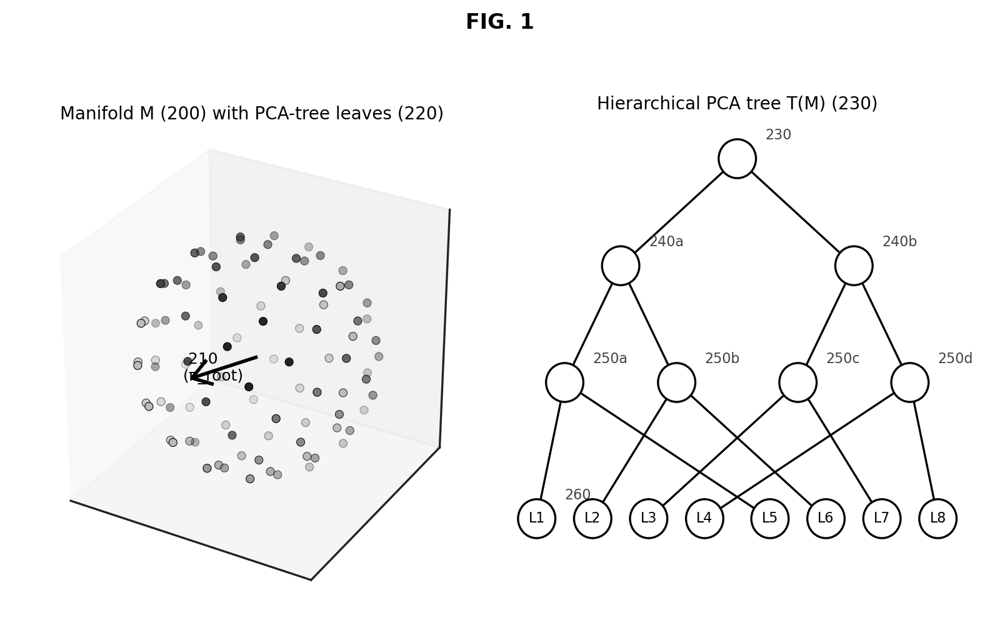
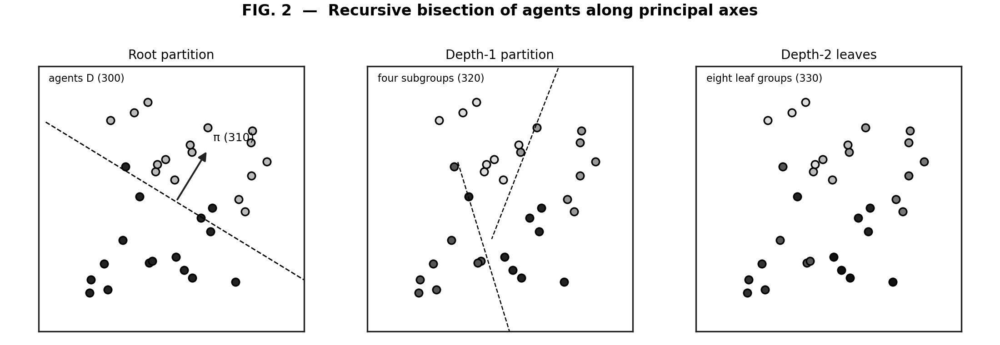
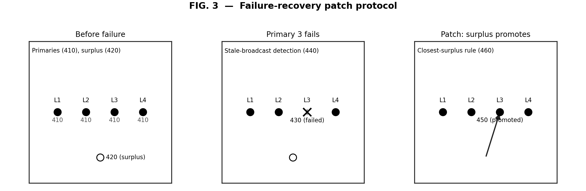
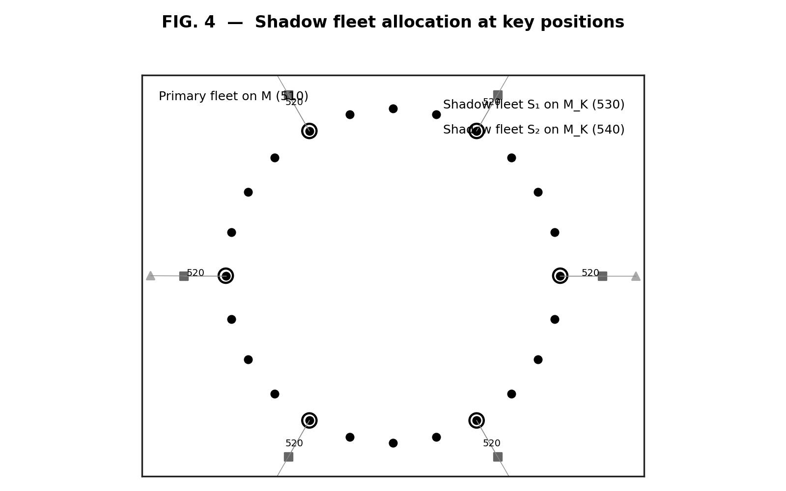
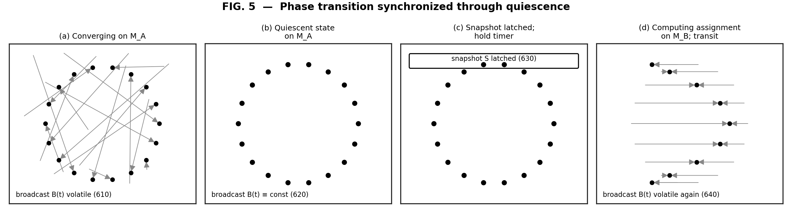
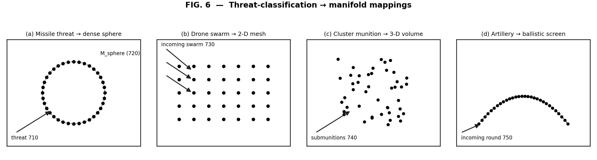
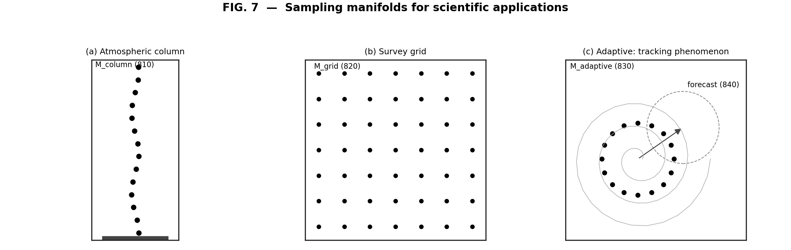
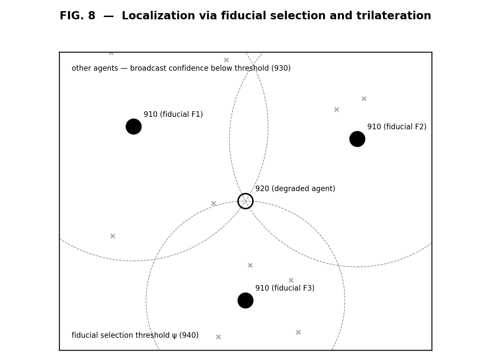

## Abstract

[0001] A method and system for coordinating a plurality of autonomous agents using a single shared broadcast channel and a deterministic hierarchical bisection algorithm operating on a target manifold. Each agent receives the same broadcast snapshot of state from substantially all agents in the system and independently executes an identical computation comprising (i) construction of a Principal Component Analysis (PCA) tree on the target manifold, (ii) recursive partitioning of the agent set along the principal axes of that tree in proportion to subtree sizes, and (iii) deterministic distance-based selection of a primary agent at each leaf. Because the computation is deterministic and the broadcast input is byte-identical across all agents, every agent independently arrives at the same global assignment without inter-agent message exchange beyond the broadcast itself. Embodiments include a closest-surplus patch protocol that produces exactly one reassignment per agent failure, priority-aware shadow fleet allocation against sub-manifolds derived from designated key positions, phase-transition synchronization through quiescent broadcast states, threat-classification and sensing-objective driven manifold generation, and cooperative localization through deterministically selected high-confidence fiducials.

## Field of the Invention

[0002] The invention relates to coordination of autonomous multi-agent systems, including but not limited to unmanned aerial vehicle (UAV) swarms, unmanned ground vehicle (UGV) swarms, distributed sensor networks, and software agent collectives. More specifically, the invention provides methods and systems for assigning agents to spatial or logical positions, recovering from agent failures, allocating priority-based redundancy, and maintaining shared state, all without inter-agent message exchange beyond a common broadcast channel.

## Background of the Invention

[0003] Existing methods for coordinating multi-agent systems generally fall into one of three categories.

[0004] Centralized coordination relies on a single authority that observes all agents, computes globally optimal assignments using algorithms such as the Kuhn–Munkres (Hungarian) algorithm, and dispatches instructions to each agent. This approach achieves optimal solutions but suffers from a single point of failure, scales poorly with agent count due to $O(N^3)$ computation cost, requires high-bandwidth communication between the authority and every agent, and cannot recover gracefully when the central authority is degraded or destroyed.

[0005] Distributed auction-based coordination, such as Consensus-Based Bundle Algorithms (CBBA), achieves decentralization through multiple rounds of inter-agent message exchange in which agents bid on tasks. This approach scales better than centralized coordination and tolerates loss of individual agents, but requires substantial inter-agent communication bandwidth, is vulnerable to communication denial or jamming, and exhibits convergence times that increase with agent count and task complexity.

[0006] Implicit coordination methods, such as those based on local sensing or biologically-inspired flocking rules, achieve coordination without explicit messaging but generally cannot guarantee globally consistent assignments, do not handle priority differentiation among positions, and are difficult to verify formally.

[0007] A need therefore exists for a coordination method that combines the global consistency of centralized approaches with the resilience and bandwidth efficiency of distributed approaches, while requiring no inter-agent messaging beyond a single shared broadcast.

## Summary of the Invention

[0008] The invention provides methods and systems for decentralized coordination of multi-agent systems through broadcast-shared state and deterministic hierarchical bisection. In one aspect, every agent in a multi-agent system independently runs an identical deterministic computation against a common broadcast input, and as a consequence of the algorithm's determinism, every agent arrives at the same global assignment without exchanging messages with any other agent.

[0009] In a further aspect, the deterministic computation comprises constructing a Principal Component Analysis (PCA) tree on a target manifold, recursively partitioning the agents along the tree's principal axes in proportion to subtree sizes, and assigning each agent to a leaf position via deterministic distance-based selection.

[0010] In a further aspect, the system handles agent failure through a local patch protocol in which a designated surplus agent autonomously promotes itself to fill the position of a failed primary agent, with the promotion occurring through the same deterministic computation against the updated broadcast state and producing exactly one reassignment per failure event.

[0011] In a further aspect, the system supports priority-aware redundancy through one or more shadow fleets that run the same hierarchical bisection algorithm against sub-manifolds derived from a designated key-position list, the shadow fleets providing concentrated redundancy at high-priority positions while a primary fleet covers the full manifold.

[0012] In a further aspect, the target manifold may be modified during operation through a phase-transition mechanism in which a quiescent broadcast state — wherein all agents have reached their assigned positions — serves as a synchronization point at which every agent independently begins computing assignments against a new manifold, achieving consensus on the new assignment without coordination overhead.

[0013] In a further aspect, the manifold-generation function may be parameterized on operational inputs including but not limited to: artistic choreography data, motion capture streams, threat classifications, environmental sensor data, mission objectives, sampling requirements, or any other input that can be expressed as a target point set or as a function that produces a target point set.

[0014] In a further aspect, the system supports operation under degraded position information through a localization protocol in which agents with degraded position confidence trilaterate against fiducials selected through the same deterministic-consensus computation applied to broadcast position confidence values.

## Brief Description of the Drawings

[0015] **FIG. 1** illustrates a target manifold (200) and the hierarchical PCA tree T(M) (230) constructed thereon, with leaf groupings (220) and the root principal axis (210).

[0016] **FIG. 2** illustrates the recursive bisection of the agent set (300) along principal axes (310), proceeding from a root partition through depth-1 subgroups (320) to depth-2 leaf groups (330).

[0017] **FIG. 3** illustrates the failure-recovery patch protocol, including primaries (410), surplus agent (420), failed primary (430), stale-broadcast detection (440), promoted surplus (450), and the closest-surplus rule (460).

[0018] **FIG. 4** illustrates the shadow fleet structure, including the primary fleet on manifold M (510), designated key positions (520), and one or more shadow fleets (530, 540) running the same algorithm against sub-manifold M_K.

[0019] **FIG. 5** illustrates the phase-transition mechanism, including (a) convergent transit with volatile broadcast (610), (b) the quiescent state (620), (c) snapshot latching and hold timer (630), and (d) renewed transit toward the updated manifold (640).

[0020] **FIG. 6** illustrates example threat-classification-to-manifold mappings, including (a) dense spherical formation against a missile threat (710, 720), (b) two-dimensional mesh against a drone-swarm threat (730), (c) three-dimensional volumetric formation against cluster munitions (740), and (d) ballistic-trajectory screen against artillery (750).

[0021] **FIG. 7** illustrates example scientific sampling manifolds, including (a) a vertical atmospheric column (810), (b) a horizontal aerial-survey grid (820), and (c) an adaptive manifold (830) tracking a moving phenomenon along a forecast trajectory (840).

[0022] **FIG. 8** illustrates the localization-via-fiducial-selection protocol, including high-confidence fiducials (910), a degraded agent (920) trilaterating against them, broadcast participants below the confidence threshold (930), and the deterministic fiducial-selection threshold (940).

## Detailed Description of the Invention

### The Coordination Substrate

[0023] The invention operates over a coordination substrate comprising:

- A broadcast channel **B** (100) accessible to all agents, providing each agent with read access to a current snapshot of state contributed by every other agent. The broadcast channel may be implemented through any of: radio frequency broadcast, optical communication, networked publish–subscribe systems, ultrawide-band mesh, or any other mechanism providing the property that every agent reads the same state at the same logical time.

- A set of agents **D** = {$d_1$, …, d_n} (300), each possessing position data $p(d_i) \in \mathbb{R}^{3}$ (or analogous coordinates for non-physical agents), broadcast capability for publishing its own state, and onboard computation sufficient to execute the assignment algorithm described below.

- A target manifold **M** = {$m_1$, …, m_N} $\subset \mathbb{R}^{3}$ (200) (or analogous coordinates), being an ordered set of N points to which agents are to be assigned. The manifold may be static (specified at initialization) or dynamic (updated through broadcast during operation).

[0024] In typical operating conditions, the number of agents n is chosen to be greater than or equal to N, with the difference $n - N$ constituting a surplus pool used by the patch protocol described below.

### The Assignment Algorithm

[0025] The assignment algorithm comprises the following steps, performed independently by each agent against the common broadcast state. FIG. 1 illustrates the manifold partition; FIG. 2 illustrates the agent partition.

[0026] *Step A — manifold tree construction.* Construct a PCA tree T(M) (230) on the target manifold by recursive bisection. At each internal node v of the tree, compute the centroid c_v of the points $L_v \subseteq M$ associated with that node, compute the leading principal axis $\pi_v$ (210) of those points, and partition L_v into two subsets L_{v_L} and L_{v_R} of sizes $\lfloor |L_v|/2 \rfloor$ and $\lceil |L_v|/2 \rceil$ respectively, based on projection rank along $\pi_v$. Recursion terminates when $|L_v| = 1$, producing leaves (220) each corresponding to exactly one target position $m_v$.

[0027] *Step B — agent partition.* For each agent d_i, traverse the tree from root to leaf as follows: at each internal node v with associated agent subset D_v (initially D_root = D), compute

> d_left = round(|D_v| $\cdot$ |L_{v_L}| / |L_v|)
>
> d_right = |D_v| − d_left;

sort D_v by projection rank along the *same* principal axis $\pi_v$; assign the d_left agents with smallest projection to D_{v_L} and the rest to D_{v_R}; recurse into whichever child contains d_i. The proportional sizing ensures that the agent subtree sizes remain consistent with the leaf subtree sizes, so that surplus capacity is uniformly distributed across the manifold rather than concentrated in any subtree.

[0028] *Step C — leaf assignment.* Upon reaching a leaf v with $|L_v| = 1$, designate the agent in D_v with smallest distance to the single target point $m_v$ as the *primary* (410) for that leaf, with ties broken deterministically by agent identifier; remaining agents in D_v are designated *surplus* (420) and assume the centroid of the parent node as their target.

[0029] Because every agent in the system runs this identical computation against the same broadcast state, every agent arrives at the same global assignment. No agent communicates its assignment to any other agent; consensus is achieved through determinism applied to a shared input rather than through message exchange. This property is hereinafter referred to as *deterministic consensus through broadcast*.

{width=100%}

{width=100%}

### Failure Recovery via Patch Protocol

[0030] When an agent fails — defined as ceasing to publish broadcast updates within a stale-detection threshold (440) — the patch protocol activates as illustrated in FIG. 3.

[0031] *Step P1 — detection.* Each surviving agent independently detects the failure (430) through absence of broadcast updates from the failed agent's identifier within a configurable stale-detection window.

[0032] *Step P2 — selection.* Each surviving agent independently computes which surplus agent (420) is closest to the failed primary's leaf position, using the same deterministic computation applied to the updated broadcast state. The closest-surplus rule (460) is itself an instance of deterministic consensus through broadcast: every surviving agent identifies the same unique surplus by applying the same computation to the same broadcast.

[0033] *Step P3 — promotion.* The unique surplus agent identified by this computation autonomously promotes itself to primary status at the failed leaf (450), ceasing to target its previous parent-centroid position and assuming the failed primary's target.

[0034] *Step P4 — quiescence.* All other agents retain their existing assignments, with the failure thereby producing exactly one reassignment by construction, regardless of which agent failed or where in the manifold the failure occurred.

{width=100%}

[0035] In the case where a contiguous cluster of *K* agents fails simultaneously (for example, due to a localized environmental event), the same protocol operates iteratively or in parallel: when surplus capacity *S* in the affected sub-manifold satisfies $S \geq K$, the system promotes exactly K surplus agents and leaves zero positions unfilled. When $S < K$, the system promotes all available surplus and leaves exactly $K - S$ positions unfilled, achieving graceful degradation that is monotone in surplus capacity.

### Priority-Aware Redundancy via Shadow Fleets

[0036] The system supports differential redundancy across positions through a shadow fleet architecture, illustrated in FIG. 4 and comprising:

[0037] A designation of a subset of leaves as *key positions*, $\mathbf{K} \subseteq \{1, \ldots, N\}$ (520), transmitted as part of the broadcast state.

[0038] One or more shadow fleets $\mathbf{S}_1$, $\mathbf{S}_2$, ... (530, 540), each comprising a subset of the surplus agent pool, running the assignment algorithm against a sub-manifold $M_K = \{m_i : i \in \mathbf{K}\}$ offset from the primary manifold by a configured safety distance.

[0039] Selective patch-protocol behavior in which, on failure of a key primary, the closest live agent in the relevant shadow fleet is promoted; and on failure of a non-key primary, the closest live agent in the broader surplus pool is promoted.

[0040] Cross-fleet promotion as a safety valve: when a same-tier shadow fleet is exhausted, agents from other fleets may be promoted at increased flight cost, ensuring that no leaf is left unfilled while shadow capacity remains anywhere in the swarm.

[0041] The key-position designation may be updated during operation through the broadcast state, with shadow fleets reorganizing to track new key positions through the same phase-transition mechanism described below.

{width=85%}

### Phase Transitions

[0042] The system supports updating the target manifold during operation through the synchronization mechanism illustrated in FIG. 5.

[0043] *Step T1 — convergence.* Agents are converging toward the current manifold M_A; the broadcast $B(t)$ (610) contains volatile, time-varying position estimates.

[0044] *Step T2 — quiescence.* When all agents have reached their assigned positions, the broadcast state contains constant positions for all agents (620). Quiescence is detected locally by each agent by observing that the broadcast snapshot has not changed beyond a configurable tolerance for a configurable hold window.

[0045] *Step T3 — latching.* Each agent independently latches the moment it observes the quiescent state, snapshots the broadcast at that moment (630), and begins a configurable hold timer.

[0046] *Step T4 — assignment computation.* Upon expiration of the hold timer, each agent independently computes assignments against the new manifold M_B using the snapshotted broadcast as input.

[0047] *Step T5 — transit.* Agents transit from their old positions on M_A toward the newly computed positions on M_B; broadcast $B(t)$ is again volatile (640).

[0048] Because the snapshot is byte-identical across all agents — a consequence of broadcasting constant positions during the quiescent window — every agent computes the same assignment against the new manifold, achieving consensus on the transition without explicit coordination. The phase-transition mechanism is thereby a special case of deterministic consensus through broadcast in which the input is a frozen snapshot.

{width=100%}

### Manifold Generation Functions

[0049] The target manifold (200) may be generated by any function that produces a target point set, including but not limited to those illustrated in FIG. 6 and FIG. 7.

[0050] *Static parametric manifolds* such as spheres, toroids, cubes, stars, or other geometric shapes specified by parameters transmitted in the broadcast.

[0051] *Dynamic manifolds derived from external data sources* including motion capture streams, three-dimensional renderings, audio-reactive generators, or live performance data.

[0052] *Threat-responsive manifolds* derived from threat classification, in which a perimeter sensor or other detection mechanism identifies an incoming threat (710, 730, 740, 750), broadcasts a threat classification and trajectory, and each agent computes the same intercept manifold from a deterministic mapping between threat type and counter-geometry. Examples include but are not limited to:

- Dense spherical formations (720) for single high-value missile threats (FIG. 6(a));
- Two-dimensional mesh formations for incoming drone-swarm threats (FIG. 6(b));
- Stochastically distributed three-dimensional volumes for cluster-munition threats (FIG. 6(c));
- Sparse sensor meshes for hypersonic threats; and
- Dense ballistic-trajectory screens for artillery threats (FIG. 6(d)).

{width=100%}

[0053] *Sampling manifolds* derived from environmental or scientific objectives, in which the manifold is configured to provide measurement coverage of a target volume of interest. Examples include but are not limited to:

- Vertical sampling columns (810) for atmospheric research (FIG. 7(a));
- Horizontal grids (820) for aerial survey work (FIG. 7(b)); and
- Adaptive geometries (830) that reform as a target phenomenon (such as a tornado, wildfire, or chemical plume) tracks through space along a forecast trajectory (840) (FIG. 7(c)).

[0054] *Search-and-rescue manifolds* in which priority-aware redundancy is allocated to high-likelihood-of-target regions identified by external information.

[0055] *Agricultural and inspection manifolds* adapted to crop conditions, structural conditions, or other dynamic environmental factors.

[0056] In each case, the manifold-generation function is the input to the same underlying assignment algorithm; the algorithm itself does not change as application changes.

{width=100%}

### Localization Under Position Uncertainty

[0057] The system supports operation under degraded position information through a localization protocol illustrated in FIG. 8 and comprising the following steps.

[0058] *Step L1 — sensor fusion.* Each agent maintains a position estimate derived from a fusion of available sensors including but not limited to: Global Navigation Satellite System (GNSS) receivers, Inertial Measurement Units (IMUs), visual odometry, ultrawide-band ranging, or any other position-determining sensor.

[0059] *Step L2 — confidence broadcast.* Each agent broadcasts its position estimate together with a confidence value derived from the sensor fusion.

[0060] *Step L3 — fiducial selection.* When the highest-confidence agents form a sufficient set for trilateration (typically three or more agents in three-dimensional space, with redundancy improving robustness against falsified or erroneous positions), the fiducial set is identified by applying a deterministic confidence threshold $\psi$ (940) to the broadcast confidence values, optionally combined with a deterministic geometric-coverage criterion. Agents below the threshold (930) are excluded from the fiducial set.

[0061] *Step L4 — trilateration.* Agents with degraded confidence (920) trilaterate against the selected fiducials (910) using their broadcast positions as reference points.

[0062] The fiducial-selection process is itself an instance of deterministic consensus through broadcast: every agent applies the same threshold-and-selection logic to identify the same fiducial set from the broadcast, ensuring that all agents trilaterate against the same reference points.

{width=85%}

### Adversarial Robustness

[0063] In a further embodiment, the broadcast channel is augmented with a witness-alarm protocol in which each agent that possesses both a working position fix and a sensor capable of observing neighboring agents (for example, ultrawide-band time-of-flight, optical fiducial detection, or stereo vision) computes for each observed neighbor the difference between (i) the neighbor's broadcast-claimed position and (ii) the position implied by the observer's own position fix combined with the relative observation. When this difference exceeds a configurable threshold expressed in units of the combined sensor noise (for example, k × $\sigma_{\mathrm{total}}$ for $k \geq 5$), the observer broadcasts an alarm naming the suspected agent. When alarms from at least a configurable consensus count of independent observers name the same suspected agent, that agent is excluded from the assignment computation through the same deterministic consensus mechanism. Detection of physical–broadcast inconsistency thereby provides primary defense against adversarial agents whose broadcast claims are inconsistent with their physically observable positions.

### Determinism and Implementation Considerations

[0064] In a further embodiment, all floating-point computations performed by each agent are executed in a manner that ensures byte-identical numerical results across heterogeneous hardware. This may be achieved by, for example, restricting computations to operations defined by IEEE-754 with deterministic rounding modes, avoiding compiler reorderings of associative operations through controlled compilation flags, and where necessary using fixed-point arithmetic at well-defined intermediate stages. Empirical validation has shown that the assignment computation is robust to perturbations in input position up to physically meaningful tolerances and that floating-point determinism yields differences in computed positions on the order of $10^{-15}$ meters across reference platforms.

## Claims

1. A method for coordinating a plurality of autonomous agents, comprising:
   (a) each agent receiving, via a shared broadcast channel, state data from substantially all agents in the plurality;
   (b) each agent independently executing a deterministic assignment computation against the broadcast state; and
   (c) each agent autonomously moving to or operating at a position determined by the assignment computation,
   wherein the deterministic assignment computation produces a globally consistent assignment across all agents in the plurality without inter-agent message exchange beyond the shared broadcast channel.

2. The method of claim 1, wherein the deterministic assignment computation comprises:
   (a) constructing a hierarchical Principal Component Analysis (PCA) tree on a target manifold;
   (b) recursively partitioning the agents along the principal axes of the tree, in each partition allocating agents to subtrees in proportion to subtree sizes; and
   (c) at each leaf of the tree, designating an agent as primary based on minimum distance to the corresponding target point with deterministic tie-breaking, and designating remaining agents in the leaf subtree as surplus.

3. The method of any preceding claim, further comprising a failure-recovery protocol in which:
   (a) absence of broadcast updates from a primary agent for at least a stale-detection threshold is detected independently by each surviving agent;
   (b) each surviving agent independently identifies, through the deterministic assignment computation applied to the updated broadcast state, a unique surplus agent closest to the failed primary's leaf position; and
   (c) the identified surplus agent autonomously promotes itself to fill the failed primary's position, producing exactly one reassignment per failure event.

4. The method of any preceding claim, further comprising one or more shadow fleets, each shadow fleet comprising a subset of surplus agents that runs the deterministic assignment computation against a sub-manifold derived from a designated key-position list, the shadow fleets thereby providing differential redundancy at high-priority positions while a primary fleet covers a full target manifold.

5. The method of claim 4, further comprising cross-fleet promotion in which, when a same-tier shadow fleet is exhausted, agents from another fleet are promoted to cover key-position vacancies, with selection performed via the deterministic assignment computation against a remaining-agent broadcast.

6. The method of any preceding claim, further comprising a phase-transition mechanism in which:
   (a) a quiescent broadcast state is detected by each agent independently;
   (b) each agent independently latches a snapshot of the broadcast at the moment of quiescence;
   (c) after expiration of a hold timer, each agent independently computes a new assignment against an updated target manifold using the latched snapshot; and
   (d) the agents transit to the new positions, with consensus on the new assignment achieved through byte-identical snapshots and deterministic computation, without explicit coordination.

7. The method of any preceding claim, wherein the target manifold is generated by a function parameterized on operational inputs selected from the group consisting of: artistic choreography data, motion capture data, threat classification data, environmental sensor data, sampling-coverage objectives, search-and-rescue priority maps, agricultural condition data, infrastructure-inspection condition data, and combinations thereof.

8. The method of claim 7, wherein the operational input comprises a threat classification, and wherein the function maps the threat classification to a counter-geometry selected from the group consisting of: dense spherical formations against missile threats, two-dimensional mesh formations against drone-swarm threats, three-dimensional volumetric formations against cluster munitions, sparse sensor meshes against hypersonic threats, and ballistic-trajectory screens against artillery threats.

9. The method of any preceding claim, further comprising a localization protocol in which:
   (a) each agent broadcasts a position estimate together with a confidence value;
   (b) a fiducial set is identified by applying a deterministic confidence threshold and optionally a deterministic geometric-coverage criterion to the broadcast confidence values, such that every agent identifies the same fiducial set; and
   (c) agents with degraded position confidence trilaterate against the broadcast positions of the fiducial set.

10. The method of any preceding claim, further comprising a witness-alarm protocol in which an agent compares (i) a neighbor's broadcast-claimed position against (ii) a position implied by the agent's own position fix combined with a relative observation of the neighbor, and broadcasts an alarm when the difference exceeds a configurable multiple of combined sensor noise; and wherein an agent named by alarms from at least a configurable consensus count of independent observers is excluded from the assignment computation.

11. A system comprising a plurality of autonomous agents, each agent comprising:
    - a broadcast receiver configured to receive state data from other agents over a shared broadcast channel;
    - a broadcast transmitter configured to publish the agent's own state data over the shared broadcast channel;
    - one or more processors configured to execute the deterministic assignment computation of any of claims 1 through 10; and
    - one or more actuators configured to move or operate the agent in accordance with an output of the deterministic assignment computation.

12. The system of claim 11, wherein the agents are unmanned aerial vehicles.

13. The system of claim 11 or 12, wherein the agents are configured to operate as a drone light show, with the target manifold derived from artistic choreography or live performance data.

14. The system of any of claims 11 through 13, wherein the agents are configured to provide reactive defense against incoming threats, with the target manifold derived from a threat classification.

15. The system of any of claims 11 through 14, wherein the agents are configured to provide environmental sampling, with the target manifold derived from sampling objectives and updated reactively as a target phenomenon evolves.

16. The system of any of claims 11 through 15, wherein the agents are configured to provide search-and-rescue coverage, with priority-aware redundancy allocated to high-likelihood-of-target regions identified by external information.

17. A non-transitory computer-readable medium storing instructions that, when executed by one or more processors of an autonomous agent, cause the agent to perform the method of any of claims 1 through 10.

## Reference to Related Work

[0065] The inventor's prior published research artifacts include "Decentralized Drone Swarm Coordination via Broadcast-as-Shared-State and Hierarchical PCA-Tree Bisection" (paper, May 2026), available at <https://doi.org/10.5281/zenodo.19954717>, together with the associated software archive at <https://doi.org/10.5281/zenodo.19954678> and the corresponding source repository at <https://github.com/jmcentire/drone-swarm-coordination>. These artifacts describe substantially the same invention with empirical validation across $N = 10$ to $N = 10$,000 agents and formal proofs including a slot-disjointness composition lemma, a three-part inter-layer composition theorem, and a rigorous $O(1/\sqrt{N})$ bound on the rounding contribution to optimality gap.

[0066] Prior art in the field includes the Kuhn–Munkres algorithm (Kuhn 1955; Munkres 1957) for centralized assignment; the Concurrent Assignment and Planning of Trajectories (CAPT) algorithm (Turpin, Michael, and Kumar, 2014) for centralized multi-robot coordination; the Consensus-Based Bundle Algorithm (CBBA) of Choi, Brunet, and How (2009) for distributed auction-based assignment; recursive-inertial-bisection methods from parallel scientific computing (Simon 1991); and implicit-coordination approaches such as Berlinger et al.'s Blueswarm (2021). The invention is distinguished from each of these by the specific synthesis of (i) broadcast-shared state, (ii) deterministic hierarchical bisection with proportional surplus distribution, (iii) closest-surplus patch recovery producing exactly one reassignment per failure, (iv) priority-aware shadow allocation against sub-manifolds, and (v) phase-transition synchronization through quiescent broadcast — all operating without inter-agent messaging beyond the shared broadcast.

---

**End of Provisional Application**
